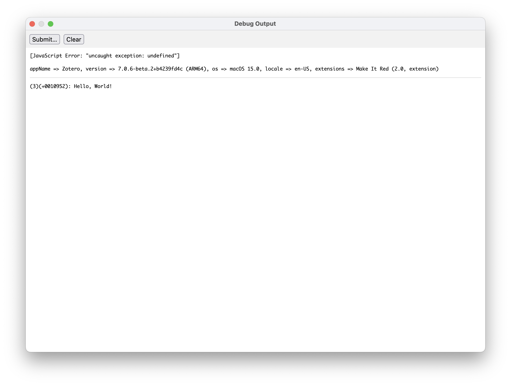
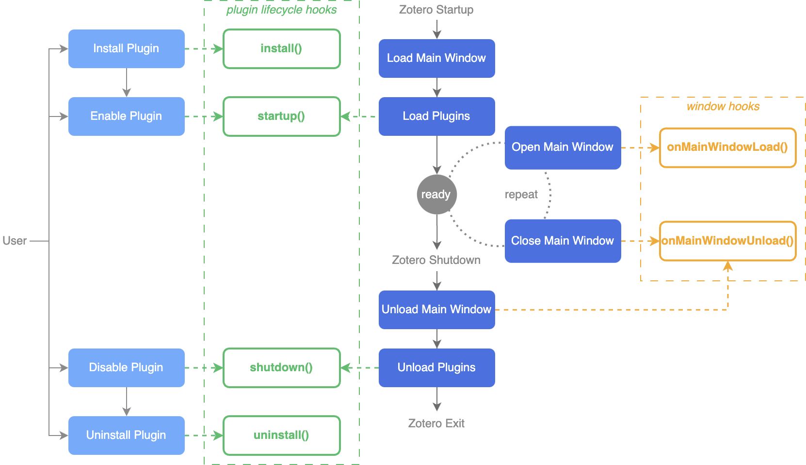
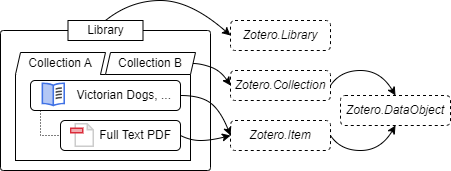
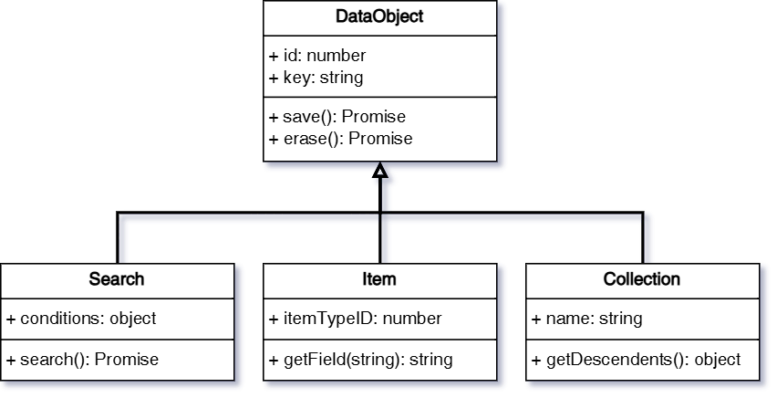
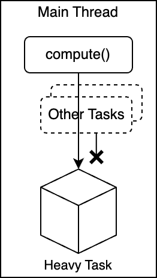
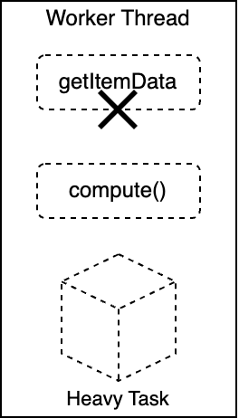
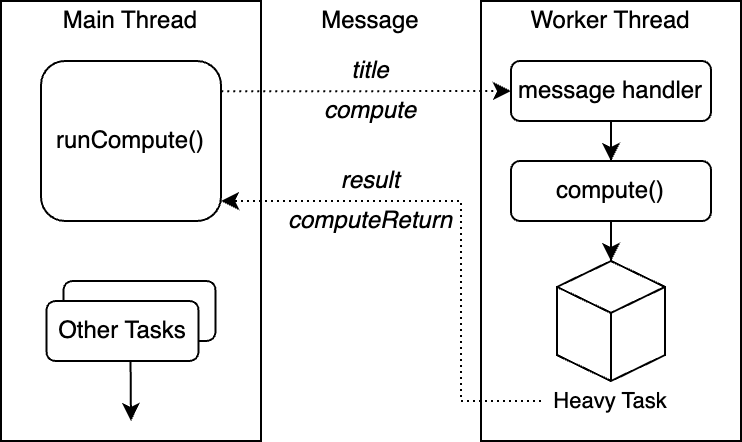

<!-- markdownlint-disable MD033 MD036 MD040 -->

# 1 Getting Started

## 1.1 What is Zotero Plugin

Zotero plugins allow users to customize and extend the capabilities of the Zotero reference management tool. These plugins can add new features, improve workflows, or enhance Zotero's user experience.

While Zotero plugins share some structural similarities with browser extensions, developing a plugin for Zotero differs in important ways. Zotero is a desktop application, meaning that its plugins can interact directly with the Zotero database, access local files, and communicate with external software. This makes Zotero plugins highly flexible and powerful, allowing for more advanced customizations compared to browser-based extensions.

For example, many plugins leverage Zotero's platform and APIs to:

- Automate citation formatting
- Integrate Zotero with other research or productivity tools
- Customize Zotero’s interface to fit specific workflows

Don’t worry if some of these features sound unfamiliar. In this guide, we’ll walk you through the process step by step, ensuring that even beginners can get up to speed with plugin development.

## 1.2 Prerequisites

Before you begin, ensure you have the following:

- **Basic knowledge of web technologies**: Familiarity with [HTML](https://developer.mozilla.org/en-US/docs/Web/HTML), [CSS](https://developer.mozilla.org/en-US/docs/Web/CSS), and [JavaScript](https://developer.mozilla.org/en-US/docs/Web/JavaScript).
- **Zotero installed**: Download and install the latest version of [Zotero Beta](https://www.zotero.org/support/beta_builds).
- **A feature idea**: Think of a simple feature or functionality you’d like to add to Zotero. Even small changes can help you get familiar with plugin development.

## 1.3 Your First Plugin

In this section, you’ll learn how to develop a simple Zotero plugin using the official example plugin, [Make-It-Red](https://github.com/zotero/make-it-red). By the end, you will have a working plugin that modifies Zotero’s appearance. This is a simple project that is ideal for beginners who want to get familiar with Zotero plugin development.

### 1.3.1 Developing the Plugin

Before starting, ensure you have [Git](https://git-scm.com/) and [NodeJS](https://nodejs.org/) installed. Git allows you to clone (download) the project, and NodeJS is required to install and build the plugin’s dependencies.

First, open your terminal and clone the official example plugin repository:

```bash
git clone git@github.com:zotero/make-it-red.git
```

Next, enter the project folder and install the required dependencies (libraries the plugin needs to work):

```bash
cd ./make-it-red
npm install
```

Once the dependencies are installed, build the plugin by running the following command:

```bash
npm run build
```

The build process will generate the plugin file `build/make-it-red-2.0.xpi`.

> 🔗 Zotero plugins use the `.xpi` file extension, which contains all the plugin’s scripts and resources. See [Plugin File Structure](#141-plugin-file-structure) for more details.

### 1.3.2 Running the Plugin

#### 1.3.2.1 Installing Manually

For plugin developers, it's always recommended to use [Beta Builds](https://www.zotero.org/support/beta_builds).

> 🔗 When developing plugins, it’s highly recommended to use a separate profile to protect your main library. Follow [this guide](https://www.zotero.org/support/kb/multiple_profiles) to create a new profile.

In the Zotero menu bar, click `Tools` -> `Plugins` to open the _Plugins Manager_ window.

To install the plugin:

1. Click the settings (⚙️) icon in the top-right of the _Plugins Manager_ window.
2. Select `Install Plugin From File...` and choose the `xpi` file you built.
3. Alternatively, drag-and-drop the `xpi` file into the _Plugins Manager_ window.

After the plugin is successfully installed, it will be listed in the _Plugins Manager_. You can verify that the _Make-It-Red_ plugin works by checking the text in the items and library list—if it turns red, the installation was successful.


#### 1.3.2.2 Loading from Source Code

It can be frustrating to manually install the plugin every time you make a change. To streamline development, you can load the plugin directly from the source code, ensuring that the latest version is used whenever Zotero is started.

After creating your plugin's source directory with sample code, you can tell Zotero to load the plugin by creating an extension proxy file. (This is a technique that used to be possible for Firefox extension development, though it's since been discontinued in Firefox.)

1. Close Zotero.
2. Create a text file in the `extensions` directory of your Zotero profile directory named after the extension id (e.g., `myplugin@mydomain.org`). The file contents should be the absolute path to the root of your plugin source code directory, where your `manifest.json` or `bootstrap.js` file is located.
3. Open `prefs.js` in the Zotero profile directory in a text editor and delete the lines containing `extensions.lastAppBuildId` and `extensions.lastAppVersion`. Save the file and restart Zotero. This will force Zotero to read the 'extensions' directory and install your plugin from the source, after which you should see it listed in Tools → Add-ons. This is only necessary once.
4. Whenever you make changes to your plugin code, start Zotero from the command line and pass the `-purgecaches` flag to force Zotero to re-read any cached files. (This may no longer be necessary with Zotero 7.) You'll likely want to make an alias or shell script that also includes the `-ZoteroDebugText` and `-jsconsole` flags and perhaps `-p <Profile>`, where `<Profile>` is the name of a development profile.

> 💡 Try this out!
>
> After setting up the development environment, make a change to the plugin code and see the result in Zotero.
> Let's _make it blue_, instead of red.
>
> Modify your plugin's code and observe the changes in Zotero.
>
> 1. Open `src/style.css` and change `color: red;` to `color: blue;`.
> 2. Run `npm run build`, then manually reinstall the plugin.
> 3. Restart Zotero and you'll see the items list now displayed in blue.

### 1.3.3 Debugging the Plugin

#### 1.3.3.1 _Run JavaScript_ Window

You can run JavaScript code directly in Zotero using the _Run JavaScript_ window, which is the easiest way to test code snippets.

To access the window:

1. Go to `Tools` → `Developer` → `Run JavaScript`.
2. Type your code in the left panel.
3. Click `Run`, and the results will be displayed on the right.

> 💡 Try this out!
>
> Select an item in the library, then run `ZoteroPane.getSelectedItems()[0]` in the _Run JavaScript_ window.
> This will return the first selected item in your library.


> 🔗 For more details about the _Run JavaScript_ window, see [Running Ad Hoc JavaScript in Zotero](https://www.zotero.org/support/dev/client_coding/javascript_api#running_ad_hoc_javascript_in_zotero).

#### 1.3.3.2 Debug Output

Zotero provides a built-in debug output system that helps developers track issues.

To log debug messages, use the `Zotero.debug` function. You can view the debug output by going to `Help` → `Debug Output Logging` → `View Output`.

> 💡 Try this out!
>
> In the _Run JavaScript_ window, run the code `Zotero.debug("Hello, World!")`. Then check the debug output window to see the message.



> 🔗 For more details about using the debug output, see [Debug Output Logging](https://www.zotero.org/support/debug_output#zotero).

Although it's not possible for plugin developers to access users' debug output using the Debug ID, you can ask users to enable debug output, reproduce the issue, and send you the debug output.

#### 1.3.3.3 DevTools

Since Zotero is built on Firefox, you can use the Firefox Developer Tools to interact with Zotero’s interface, inspect the DOM (Document Object Model), set breakpoints in your code, monitor network requests, and much more.

> 🔗 For a full guide to Firefox’s developer tools, refer to the [Firefox DevTools User Docs](https://firefox-source-docs.mozilla.org/devtools-user/).

Zotero beta builds include the Firefox 115 devtools. To start a beta build with the Browser Toolbox open, pass the `-jsdebugger` flag on the command line:

```bash
# the /path/to/zotero is the path to the Zotero executable
# For MacOS:
# /Applications/Zotero.app/Contents/MacOS/zotero
# For Windows:
# C:\Program Files (x86)\Zotero\zotero.exe
/path/to/zotero -ZoteroDebugText -jsdebugger
```

If you’re running Zotero from source code, use the `-d` flag with the  [build_and_run script](https://www.zotero.org/support/dev/client_coding/building_the_desktop_app#helper_script "dev:client_coding:building_the_desktop_app"), which will rebuild Zotero with devtools included and launch it with the `-jsdebugger` flag.


> 💡 Try this out!
>
> In the Run JS window, run `Zotero.getMainWindow().console.log("Hello, World!")`. Check the devtools' console to see the output.

## 1.4 Plugin Anatomy

In this section, we’ll cover the structure of a Zotero plugin, including the key files and how the plugin’s metadata is organized.

### 1.4.1 Plugin File Structure

A Zotero plugin is made up of a set of files, similar to a web extension, but with specific modifications to work within Zotero’s ecosystem.

#### 1.4.1.1 manifest.json

The `manifest.json` file holds the metadata for your plugin, such as its name, version, and compatibility details. This file must be in the root directory of the plugin.

Here’s a sample `manifest.json`:

```json
{
  "manifest_version": 2,
  "name": "Make It Red",
  "version": "2.0",
  "description": "Makes everything red",
  "homepage_url": "https://github.com/zotero/make-it-red",
  "icons": {
    "48": "icon.svg",
    "96": "icon.svg"
  },
  "applications": {
    "zotero": {
      "id": "make-it-red@example.com",
      "update_url": "https://zotero-download.s3.amazonaws.com/tmp/make-it-red/updates-2.0.json",
      "strict_min_version": "6.999",
      "strict_max_version": "7.0.*"
    }
  }
}
```

Explanation of the fields in the `manifest.json` file are as follows. The fields marked with `*` are required.

- `manifest_version`\*: The version of the manifest file format. The only valid value is `2`.
- `name`\*: The name of the plugin.
- `version`\*: The version of the plugin. This follows [this](https://developer.mozilla.org/en-US/docs/Mozilla/Add-ons/WebExtensions/manifest.json/version) version format.
- `description`: A brief description of the plugin. It will be shown in the _Plugin Manager_.
- `homepage_url`: The URL of the plugin's homepage. It will be shown in the _Plugin Manager_.
- `icons`: The icons for the plugin. See [icons]().

> 💡 About plugin icons
>
> For the best scalability and seamless theme integration, use the **SVG format** for your plugin icons. To ensure your icons adapt to Zotero's light and dark themes, include the attributes `fill="context-fill"` and `stroke="context-stroke"` in your SVG where appropriate. These attributes allow the icon's fill and stroke colors to inherit the foreground color of the current theme dynamically.
>
> **Best Practices**:
>
> - Test your icons in both light and dark modes to ensure they are visually clear and consistent.
> - Avoid hardcoding colors like black and white in your SVG to maintain adaptability.
>
> 🔗 For more details about working with SVGs, refer to [Mozilla - manifest.json/icons](https://developer.mozilla.org/en-US/docs/Mozilla/Add-ons/WebExtensions/manifest.json/icons).

- `applications/zotero`\*: The application-specific information. It is based on [browser_specific_settings.gecko](https://developer.mozilla.org/en-US/docs/Mozilla/Add-ons/WebExtensions/manifest.json/browser_specific_settings) and must be present for Zotero to install your plugin.
  - `id`\*: The unique identifier for the plugin. It should be in the format `myplugin@mydomain.org`.
  - `update_url`: The URL of the update manifest. See also [Plugin Update](#142-plugin-update).
  - `strict_min_version`: The minimum version of Zotero that the plugin is compatible with. You should set it to `x.x.*` of the latest Zotero minor version that you have tested your plugin with.
  - `strict_max_version`: The maximum version of Zotero that the plugin is compatible with.

#### 1.4.1.2 bootstrap.js

The `bootstrap.js` file is the main script file for the plugin. It is executed during the plugin's lifecycle, such as when the plugin is loaded, unloaded, or updated. This file must be in the root directory of the plugin.

A `bootstrap.js` file containing functions to handle various events:

- Plugin lifecycle hooks
- Window hooks

> 🔗 For more details, see [Plugin Lifecycle](#21-plugin-lifecycle).

**Plugin lifecycle hooks**

Plugin lifecycle hooks are modeled after the legacy Mozilla [bootstrapped-extension framework](http://www.devdoc.net/web/developer.mozilla.org/en-US/docs/Mozilla/Add-ons/Bootstrapped_Extensions.html#Bootstrap_entry_points "http://www.devdoc.net/web/developer.mozilla.org/en-US/docs/Mozilla/Add-ons/Bootstrapped_Extensions.html#Bootstrap_entry_points"):

- `startup()`
- `shutdown()`
- `install()`
- `uninstall()`

Plugin lifecycle hooks are passed two parameters:

- An object with these properties:
  - `id`: The string of the plugin's unique identifier.
  - `version`: The string of the current version of the plugin.
  - `rootURI`: A path string pointing to the plugin files. You can use this to load specific files within your plugin, like `rootURI + 'style.css'`.
- A number representing the reason for the event, which can be checked against the following constants: `APP_STARTUP`, `APP_SHUTDOWN`, `ADDON_ENABLE`, `ADDON_DISABLE`, `ADDON_INSTALL`, `ADDON_UNINSTALL`, `ADDON_UPGRADE`, `ADDON_DOWNGRADE`

Any initialization that isn’t specific to a window should be handled in the `startup` function, and cleanup should occur in the `shutdown` function.

The `install()` and `startup()` bootstrap methods are called only after Zotero has initialized, and the `Zotero` object is automatically made available in the bootstrap scope, along with `Services`, `Cc`, `Ci`, and other Mozilla and browser objects.

Bootstrapped plugins can be disabled or uninstalled without restarting Zotero, so you'll need to make sure you remove all functionality in the `shutdown()` function.

**Window Hooks**

Window hooks let you perform actions when the main Zotero window opens or closes. This can be helpful for managing UI changes or other window-specific behaviors:

- `onMainWindowLoad()`: Called when the main Zotero window is opened.
- `onMainWindowUnload()`: Called when the main Zotero window is closed.

These hooks are passed an object containing the `window` property, which refers to the window being opened or closed.

If the main Zotero window is already open when your plugin loads, `onMainWindowLoad` won't be called on the existing windows. You'll need to manually call it for any existing windows:

```javascript
// In bootstrap.js
async function startup(data, reason) {
  // Do any initialization that should happen when the plugin is loaded

  // After initialization, call onMainWindowLoad for any existing main windows
  await Promise.all(
    Zotero.getMainWindows().map((win) => onMainWindowLoad(win))
  );
}
```

Since the main window might be opened and closed multiple times during a session, changes you make to the UI (such as adding buttons or menus) should be done inside `onMainWindowLoad`, ensuring that every new window contains your updates.

When a window is closed, `onMainWindowUnload` is triggered. This is the time to clean up by removing any references to the window or objects within it, canceling any active timers, etc. This prevents memory leaks:

```javascript
function shutdown() {
  let windows = Zotero.getMainWindows();
  for (let win of windows) {
    win.document.getElementById("make-it-red-stylesheet")?.remove();
  }
}
```

> Currently, only one main window is supported, but some users may find ways to open multiple main windows, and this will be officially supported in a future version.

#### 1.4.1.3 Locale

Mozilla has introduced a new localization system called [Fluent](https://projectfluent.org/), replacing the older `.dtd` and `.properties` systems. While these older formats are still supported in Zotero 7, they will be removed in future versions. For future-proofing your plugin, it's recommended to use Fluent for localization.

Check out the [Fluent Syntax Guide](https://projectfluent.org/fluent/guide/ "https://projectfluent.org/fluent/guide/") to learn how to write Fluent files.

**Registering Fluent Files**

To add Fluent to your plugin, create a `locale` folder at the root of your plugin, and then add subfolders for each language. Place your `.ftl` (Fluent) files in these subfolders. For example:

```
locale/en-US/make-it-red.ftl
locale/fr-FR/make-it-red.ftl
locale/zh-CN/make-it-red.ftl
```

Any `.ftl` files you place in the locale subfolders will be automatically registered in Zotero's localization system.

To see a full list of supported languages, check the [Zotero locales](https://github.com/zotero/zotero/tree/main/chrome/locale).

> ❗️ It’s important to namespace the file names and keys in your Fluent files to avoid conflicts with Zotero or other plugins. For example, use file names like `make-it-red.ftl` instead of `strings.ftl`.

**Using a Fluent File in a Document**

Fluent files you include with your plugin can be applied to a document with a `<link>` element.

For example, a Fluent file located at

```
[plugin root]/locale/en-US/make-it-red.ftl
```

could be included in an XHTML file as

```html
<link rel="localization" href="make-it-red.ftl" />
```

If the document's default namespace is XUL, include HTML as an alternative namespace (`xmlns:html="http://www.w3.org/1999/xhtml"`) and prefix the link:

```html
<html:link rel="localization" href="make-it-red.ftl" />
```

If modifying an existing window, you can create a `<link>` element dynamically:

```javascript
// Suppose `window` is the window you're modifying
window.MozXULElement.insertFTLIfNeeded("make-it-red.ftl");
```

(`MozXULElement` will be a property of the window you're modifying.)

Please ensure that you have inserted the FTL into the window before making any changes to the DOM.

If adding to an existing window, be sure to remove the `<link>` in your plugin's `shutdown` function:

```javascript
// Suppose `window` is the window you're modifying
window.document.querySelector('[href="make-it-red.ftl"]').remove();
```

> 🔗 For more details about the Fluent localization system, see [Fluent documentation](https://projectfluent.org/dom-l10n-documentation/overview.html).

#### 1.4.1.4 Default Preferences

Zotero uses the preferences system for storing user preferences. Plugins can provide default values for its preferences in the `prefs.js` file. It should be in the root directory of the plugin.

Zotero provides a preferences system for storing user-specific settings. You can set default values for your plugin’s preferences using a `prefs.js` file. This file should be in the root directory of the plugin.

Here is an example of a `prefs.js` file:

```javascript
pref("extensions.make-it-red.intensity", 100);
```

This file defines a default preference for the "Make It Red" plugin, setting the `intensity` of the color to `100` by default.

These preferences will be read when plugins are installed or enabled and then on every startup.

> 🔗 For more details about the preferences in Zotero, see [Preferences](https://www.zotero.org/support/preferences).
> In the [Persisted Settings: Preferences](#23-persisted-settings-preferences) section, we'll cover more details about the preferences system.

### 1.4.2 Plugin Update

When you release new versions of your plugin, you can using a [Mozilla-style JSON update manifest](https://extensionworkshop.com/documentation/manage/updating-your-extension/ "https://extensionworkshop.com/documentation/manage/updating-your-extension/) to allow Zotero to check for new versions and install updates automatically.

The update manifests are set up to demonstrate upgrading across all versions, but normally a plugin would point to a single update manifest that was updated as new versions were available.

The update manifest JSON is not included in the plugin XPI file. It should be hosted online, and the URL should be specified in the plugin's `update_url` field in the `manifest.json` file of the plugin.

Here is the official plugin example's update manifest:

```json
{
  "addons": {
    // The plugin id
    "make-it-red@zotero.org": {
      "updates": [
        {
          "version": "2.0", // The version of the plugin
          "update_link": "https://download.zotero.org/plugins/make-it-red/make-it-red-2.0.xpi", // The URL of the XPI file
          "update_hash": "sha256:4a6dd04c197629a02a9c6beaa9ebd52a69bb683f8400243bcdf95847f0ee254a", // The hash of the XPI file
          "applications": {
            "zotero": {
              "strict_min_version": "6.999" // The minimum version of Zotero that the plugin is compatible with
            }
          }
        }
      ]
    }
  }
}
```

### 1.5 Contact Us

If you have questions about development or would like to discuss development with Zotero developers, you can consult and post to the [zotero-dev mailing list](https://groups.google.com/group/zotero-dev). (Please do not use the mailing list for [user support](https://www.zotero.org/support/getting_help) questions. Questions regarding the Zotero API, however, should always go to zotero-dev.)

# 2 Concepts

This section introduces some core concepts in Zotero plugin development, such as the plugin lifecycle, data model, persisted settings, notifier events, and more.

## 2.1 Plugin LifeCycle

Every Zotero plugin follows a lifecycle, from installation to uninstallation. During this cycle, the plugin triggers a series of "hooks"—points in the plugin’s execution where certain actions can be taken.

| Hook                 | Triggered when...                                                          | Description                                                                                        |
| -------------------- | -------------------------------------------------------------------------- | -------------------------------------------------------------------------------------------------- |
| `install`            | The plugin is installed or updated                                         | Set up initial configurations. This hook is only for setup tasks and the plugin isn't running yet. |
| `startup`            | The plugin is being loaded                                                 | Initialize everything needed for the plugin to function.                                           |
| `shutdown`           | The plugin is being unloaded                                               | Clean up resources before the plugin stops running.                                                |
| `uninstall`          | The plugin is being uninstalled or replaced by a newer installation        | Perform cleanup for uninstallation.                                                                |
| `onMainWindowLoad`   | The main Zotero window opens. Can happen multiple times during a session.  | Initialize UI changes for the main window.                                                         |
| `onMainWindowUnload` | The main Zotero window closes. Can happen multiple times during a session. | Remove any window-specific changes.                                                                |

The figure below illustrates the plugin lifecycle and the order in which the hooks are called.
The figure below shows the lifecycle of a plugin and how the hooks are called.



> 💡 Try this out!
>
> Add the following line to the `bootstrap.js` file's `startup()` function of the example plugin, then apply the changes and restart Zotero with debug output enabled.
>
> ```javascript
> Zotero.debug("Hello, World! The plugin is loaded.");
> ```
>
> Check the debug output to see if the message is printed when the plugin is loaded.
>
> Disable and then enable the plugin in the _Plugins Manager_ to see if the message is printed again.

## 2.2 Zotero Data Model

Zotero organizes data into different types of "data objects," which are instances of classes that represent various types of information in Zotero.

For example:

- A PDF file is represented by an attachment item object (an instance of `Zotero.Item`).
- This attachment item might have a parent item, which is a regular item (an instance of `Zotero.Item`).
- This regular item might belong to a collection (an instance of `Zotero.Collection`).
- All data objects are stored within a library (an instance of `Zotero.Library`).

This relation can be described as follows:



Each data class (like `Item` or `Collection`) has a corresponding "manager" object, which you can use to manage those instances. For example, to retrieve an `Item` object, you would use the `Zotero.Items` object:

```javascript
let item = await Zotero.Items.getAsync(itemID);
```

> ❓ What is the difference between `getAsync` and `get`?
>
> - `getAsync`: Asynchronous, ensures that the objects are loaded and returns a promise (recommended in most cases).
> - `get`: Synchronous, returns the object directly.

The table below lists the **class** and its corresponding plural **object**:

| Class               | Manager Object       |
| ------------------- | -------------------- |
| `Zotero.DataObject` | `Zotero.DataObjects` |
| `Zotero.Collection` | `Zotero.Collections` |
| `Zotero.Search`     | `Zotero.Searches`    |
| `Zotero.Item`       | `Zotero.Items`       |
| `Zotero.FeedItem`   | `Zotero.FeedItems`   |
| `Zotero.Library`    | `Zotero.Libraries`   |
| `Zotero.Group`      | `Zotero.Groups`      |
| `Zotero.Feed`       | `Zotero.Feeds`       |

### 2.2.1 Library

All items and collections in Zotero belong to a **Library**. There are three types of libraries in Zotero:

- User Library
- Group
- Feed

Each library has a unique `id`, which can be used to retrieve the library instance.

The user library is the default library that contains all the items and collections created by the user. The user library ID can be retrieved using `Zotero.Libraries.userLibraryID`.

```javascript
// The user library ID
let libraryID = Zotero.Libraries.userLibraryID;
// Get the library by ID
let library = await Zotero.Libraries.getAsync(libraryID);
// Print the library ID
Zotero.debug(library.id);
// Print the library type, which is "user" for the user library.
// Can be "group" or "feed" for other types of libraries.
Zotero.debug(library.type);
```

You can get all the libraries using `Zotero.Libraries.getAll()`.

### 2.2.2 Data Object

The `Zotero.DataObject` class is the base class for all data objects, including `Zotero.Collection`, `Zotero.Item`, and `Zotero.Search`.

Each data object has two key properties:

- `key`: A unique `string` identifier that stays the same across all devices in one library.
- `id`: A unique `number` in the local database.

> ❗️ Do not rely on the `id` for identifying the data object!
>
> The `key` is unique across all devices _(within a library)_, while the `id` is unique within the local database. In extreme cases, the `id` can be changed, but the `key` always remains the same.

Other important shared properties and methods include:

- `libraryID`: indicates which library the data object belongs to.
- `objectType`: identifies the type of the data object. Can be `collection`, `item`, `search`, etc.
- `version`: tracks the version of the data object, which increases with every update.
- `deleted`: indicates whether the data object is trashed.
- `save()` and `saveTx()`: saves the changes to the database.
- `erase()` and `eraseTx()`: completely erase the data object from the database.

To create a new data object, you can use the `new` keyword. For example, to create a new item:

```javascript
let item = new Zotero.Item();
```

After making changes, always call `save()` or `saveTx()` to store them. We'll cover this in more detail in later sections.

> ❓ What is the difference between `save()` and `saveTx()`?
>
> The `saveTx()` creates a transaction for saving the changes, while the `save()` should be called inside a [transaction](https://en.wikipedia.org/wiki/Database_transaction). For multiple changes in one transaction, they will be saved together when the transaction is committed.
>
> The `save()` is useful when you have multiple changes to save together.
>
> For `erase()` and `eraseTx()`, the same principle applies.

Besides the shared properties and methods, different types of data objects have additional properties and methods, as shown in the figure below:



We'll cover the different types of data objects in the following sections.

### 2.2.3 Collection

A **Collection** contains items and can have sub-collections.

In addition to the inherited properties and methods from the `DataObject`, a collection object has the following key properties and methods:

- `name`: the name of the collection.
- `parent`: the parent collection of the collection. A top-level collection has a `null` parent.
- `parentKey`: the key of the parent collection.
- `parentID`: the ID of the parent collection.
- `getChildCollections()`: gets the child collections of the collection.
- `getChildItems()`: gets the items in the collection.
- `addItem()`/`addItems()`: adds an item or items to the collection.
- `removeItem()`/`removeItems()`: removes an item or items from the collection.

The `Zotero.Collections` object lets you manage collection objects. Here are some examples:

```javascript
// Get all collections in the user library
let collections = Zotero.Collections.getByLibrary(
  Zotero.Libraries.userLibraryID
);
// Get the collection by key
let collection = Zotero.Collections.getByLibraryAndKey(
  Zotero.Libraries.userLibraryID,
  collections[0].key
);
// Get the collection by ID
collection = Zotero.Collections.get(collection.id);
// Get child items of the collection
let itemIDs = collection.getChildItems().map((item) => item.id);
// Get collections containing the items
collections = await Zotero.Collections.getCollectionsContainingItems(itemIDs);
```

### 2.2.4 Search

The **Search** allows plugins to search for items in a Zotero library. Plugins can define specific search conditions, execute the search, and retrieve results based on the set conditions.

Key properties and methods:

- `addCondition(field, operator, value, required): number`: adds a search condition.
- `updateCondition(searchConditionID, condition, operator, value, required): void`: updates a search condition.
- `removeCondition(searchConditionID): void`: removes a search condition.
- `getCondition(searchConditionID): ConditionType`: gets a search condition. Returns an array of `ConditionType` (object with `condition`, `operator`, `value`, `required` properties).
- `getConditions(): { [id: number]: ConditionType }`: gets all search conditions.
- `search(asTempTable): Promise<number[]> | Promise<string>`: executes the search.

<details>
<summary>All available operators and conditions</summary>

Be aware that the available operators and conditions are subject to change. Some operators and conditions are only supposed to be used internally.

```typescript
type Operator =
  | "is"
  | "isNot"
  | "true"
  | "false"
  | "isInTheLast"
  | "isBefore"
  | "isAfter"
  | "contains"
  | "doesNotContain"
  | "beginsWith"
  | "isLessThan"
  | "isGreaterThan"
  | "any"
  | "all"
  | "true"
  | "false";
type Conditions =
  | "numPages"
  | "numberOfVolumes"
  | "abstractNote"
  | "anyField"
  | "accessDate"
  | "applicationNumber"
  | "archive"
  | "artworkSize"
  | "assignee"
  | "fulltextContent"
  | "fileTypeID"
  | "author"
  | "authority"
  | "bookAuthor"
  | "callNumber"
  | "childNote"
  | "citationKey"
  | "code"
  | "codeNumber"
  | "collection"
  | "committee"
  | "conferenceName"
  | "country"
  | "creator"
  | "date"
  | "dateAdded"
  | "dateModified"
  | "DOI"
  | "edition"
  | "editor"
  | "extra"
  | "filingDate"
  | "history"
  | "ISBN"
  | "ISSN"
  | "issue"
  | "itemType"
  | "journalAbbreviation"
  | "language"
  | "libraryCatalog"
  | "archiveLocation"
  | "medium"
  | "meetingName"
  | "note"
  | "number"
  | "pages"
  | "place"
  | "priorityNumbers"
  | "programmingLanguage"
  | "publicationTitle"
  | "publisher"
  | "references"
  | "reporter"
  | "rights"
  | "runningTime"
  | "scale"
  | "section"
  | "series"
  | "seriesNumber"
  | "seriesText"
  | "seriesTitle"
  | "session"
  | "shortTitle"
  | "status"
  | "system"
  | "tag"
  | "title"
  | "type"
  | "url"
  | "versionNumber"
  | "volume"
  | "deleted"
  | "noChildren"
  | "unfiled"
  | "retracted"
  | "publications"
  | "feed"
  | "includeParentsAndChildren"
  | "includeParents"
  | "includeChildren"
  | "recursive"
  | "joinMode"
  | "quicksearch-titleCreatorYear"
  | "quicksearch-titleCreatorYearNote"
  | "quicksearch-fields"
  | "quicksearch-everything"
  | "quicksearch"
  | "blockStart"
  | "blockEnd"
  | "collectionID"
  | "savedSearchID"
  | "savedSearch"
  | "itemTypeID"
  | "tagID"
  | "lastName"
  | "field"
  | "datefield"
  | "year"
  | "numberfield"
  | "libraryID"
  | "key"
  | "itemID"
  | "annotationText"
  | "annotationComment"
  | "fulltextWord"
  | "tempTable";
```

</details>

### 2.2.5 Item

The **Item** in Zotero represents different items in the Zotero library, like books, journal articles, or files. Here are some core concepts about items:

- Regular Item: A bibliographic item, such as a book, article, or webpage.
- Attachment Item: An attachment, such as a PDF file, a snapshot, or an image in the note.
- Note Item: A note item.
- Annotation Item: An annotation item. It always belongs to an attachment item.

> 📖 Terminology: Child Item v.s. Standalone Item
>
> A child item is an item that has a parent item, such as an attachment item with a parent regular item. A standalone item is an item that does not have a parent item. Attachment items may be either child items or standalone items.

Key properties and methods include:

- `itemType`: the type of the item. For example, `book`, `journalArticle`, `attachment`, `note`, etc.
- `parentItem`: the parent item of the item. A standalone item has a `null` parent.
- `topLevelItem`: the top-level item of the item. If the item is a standalone item, the top-level item is the item itself.
- `isTopLevelItem()`: indicates whether the item is a top-level item.
- `isRegularItem()`: indicates whether the item is a regular item.
- `isAttachment()`: indicates whether the item is an attachment item.
- `isAnnotation()`: indicates whether the item is an annotation item.
- `isNote()`: indicates whether the item is a note item.
- `numChildren()`: gets the number of child items of the item.
- `getTags()`: gets the tags of the item.
- `setTags()`: sets the tags of the item.
- `replaceTag()`: replaces the tags of the item.
- `addTag()`: adds a tag to the item.
- `removeTag()`: removes a tag from the item.
- `addToCollection()`: adds the item to a collection.
- `getCollections()`: gets the collections containing the item.
- `setCollections()`: sets the collections containing the item.
- `inCollection()`: indicates whether the item is in a collection.
- `clone()`: returns an unsaved copy of the item without itemID and key.
- `moveToLibrary()`: moves the item to another library.

For Regular Items, the following additional properties and methods would be useful:

- `getField()`: gets the value of a field of the item.
- `setField()`: sets the value of a field of the item.
- `getAttachments()`: gets the attachments of the item.
- `getBestAttachment()`: gets the best attachment of the item. Look for attachments in the following order: oldest PDF attachment matching parent URL, oldest PDF attachment not matching parent URL, oldest non-PDF attachment matching parent URL, and old non-PDF attachment not matching parent URL.
- `getNotes()`: gets the notes of the item.
- `numAttachments()`: gets the number of child attachments of the item.
- `numNotes()`: gets the number of child notes of the item.
- `addRelatedItem()`: adds a related item to the item.
- `removeRelatedItem()`: removes a related item from the item.

For Attachment Items, the following additional properties and methods would be useful:

- `attachmentFilename`: the filename of the attachment.
- `attachmentPath`: the raw attachment path string as stored in DB (e.g., "storage:foo.pdf", "attachments:foo/bar.pdf", "/Users/foo/Desktop/bar.pdf"). Can be set as an absolute path or prefixed string ("storage:foo.pdf").
- `attachmentContentType`: the content type of the attachment. For example, `application/pdf`, `text/html`, `application/epub+zip`, etc.
- `attachmentText`: the text content of the attachment. Currently works on HTML, PDF, and plaintext attachments.
- `isPDFAttachment()`: indicates whether the item is a PDF attachment.
- `isSnapshotAttachment()`: indicates whether the item is a snapshot (Webpage) attachment.
- `isEPUBAttachment()`: indicates whether the item is an EPUB attachment.
- `getFilePath()`/`getFilePathAsync()`: gets the file path of the attachment.
- `fileExists()`: indicates whether the file of the attachment exists.
- `renameAttachmentFile()`: renames the file of the attachment.
- `getAnnotations()`: gets the child annotations of the attachment.

For Note Items, the following additional properties and methods would be useful:

- `getNote()`: gets the note content.
- `setNote()`: sets the note content.
- `getNoteTitle()`: gets the note title.

For Annotation Items, the following additional properties and methods would be useful:

- `annotationType`: the type of the annotation. For example, `highlight`, `text`, `image`, `ink`, `note` (sticky note, not the note item), etc.
- `annotationText`: the text content of the annotation.
- `annotationComment`: the comment of the annotation.

To create a new item, you can use the `new` keyword. For example, to create a new regular item:

```javascript
// Create a new book item
let item = new Zotero.Item("book");

// Set the title and date fields
item.setField("title", "Much Ado About Nothing");
item.setField("date", "1599");

// Add a tag
item.addTag("Shakespeare");

// Save the item to the database
await item.saveTx();
```

After making changes, always call `save()` or `saveTx()` to store them.

To trash an item, you can use `Zotero.Items.trash()`/`Zotero.Items.trashTx()`.

```javascript
// Get the item by ID
let item = await Zotero.Items.getAsync(itemID);

// Trash the item
await Zotero.Items.trashTx(item);
```

## 2.3 Persisted Settings: Preferences

Zotero allows plugins to store settings that persist across sessions. These preferences are stored as key-value pairs in Zotero’s `prefs.js` file, located in the data directory. They are available throughout the plugin but do not sync across devices.

A preference is a key-value pair. The typical format for a preference key is `extensions.myplugin.mykey`, where `myplugin` is your plugin’s unique identifier, and `mykey` is the setting’s name. Values can be strings, numbers, or booleans.

As mentioned in the [Plugin Structure/Preferences](#1414-preferences) section, the plugin can provide default values for its preferences in its own `prefs.js` file.

Use the `Zotero.Prefs` object to interact with preferences. Key methods include:

- `get(key, global)`: gets the value of a preference.
- `set(key, value, global)`: sets the value of a preference.
- `clear(key, global)`: clears the value of a preference.
- `registerObserver(key, handler, global)`: registers an observer for a preference. The handler will be called when the preference is changed.
- `unregisterObserver(observerID)`: unregisters an observer.

For example:

```javascript
// Get the value of a preference
let value = Zotero.Prefs.get("extensions.myplugin.mykey", true);
// Set the value of a preference
Zotero.Prefs.set("extensions.myplugin.mykey", "myvalue", true);
// Clear the value of a preference
Zotero.Prefs.clear("extensions.myplugin.mykey", true);
```

The `global` argument simplifies access to Zotero’s built-in preference keys. When `global` is not set or `false`, Zotero automatically prefixes the key with `"extensions.zotero."`, so you don’t need to type the full key path.

```javascript
// Using the simplified format for a built-in Zotero preference:
value = Zotero.Prefs.get("zoterokey");
// This is equivalent to the full format:
value = Zotero.Prefs.get("extensions.zotero.zoterokey", true);
```

To observe the changes of a preference:

```javascript
let key = "extensions.myplugin.mykey";
// Register the observer
let observerID = Zotero.Prefs.registerObserver(
  "extensions.myplugin.mykey",
  (value) => {
    Zotero.debug(`Preference ${key} changed to ${value}`);
  },
  true
);
```

To unregister the observer:

```javascript
Zotero.Prefs.unregisterObserver(observerID);
```

> **Tip**: For complex data, use `JSON.stringify` and `JSON.parse` to store and retrieve serialized values.

## 2.4 Notification System

Zotero’s notification system allows plugins to respond when certain events occur, such as when items are added, modified, or removed from the library. This system is used internally to update the user interface when data changes.

The notification system uses an "observer pattern." An observer is a function that waits for a specific event to happen, and then runs in response. Plugins can register observers to listen for specific events.

The `Zotero.Notifier` object lets you register and manage observers. Key methods include:

- `registerObserver(ref, types, id, priority): string`: registers an observer for an event. The `ref` is an object (`{ notify: (event, type, ids, extraData) => void }`) that implements the `notify` method. The `types` is an array of event types. The `id` is a unique identifier for debug output. The `priority` is the priority of the observer.
- `unregisterObserver(observerID)`: unregisters an observer.

<details>
<summary>All available event and types</summary>

The following are the available events and types. Be aware that not all types are available for all events. You can dive into [the source](https://github.com/search?q=repo%3Azotero%2Fzotero+%2Fzotero.notifier.%28queue%7Ctrigger%29%2F&type=code) for all possible notifies.

```typescript
type Event =
  | "add"
  | "modify"
  | "delete"
  | "move"
  | "remove"
  | "refresh"
  | "redraw"
  | "trash"
  | "unreadCountUpdated"
  | "index"
  | "open"
  | "close"
  | "select";
type Type =
  | "collection"
  | "search"
  | "share"
  | "share-items"
  | "item"
  | "file"
  | "collection-item"
  | "item-tag"
  | "tag"
  | "setting"
  | "group"
  | "trash"
  | "bucket"
  | "relation"
  | "feed"
  | "feedItem"
  | "sync"
  | "api-key"
  | "tab"
  | "itemtree"
  | "itempane";
```

</details>

For example, to observe the `add`, `modify`, and `delete` events on the `item` type:

```javascript
let observerID = Zotero.Notifier.registerObserver(
  {
    notify: (event, type, ids, extraData) => {
      if (type === "item") {
        Zotero.debug(`Event ${event} of type ${type} is triggered`);
      }
    },
  },
  ["add", "modify", "delete"]
);
```

You can create a new item and check the debug output to see if the output is printed.

To unregister the observer:

```javascript
Zotero.Notifier.unregisterObserver(observerID);
```

## 2.5 Privileged v.s Unprivileged: Browser Window, HTML Window, and Sandbox

In Zotero, different scopes exist for running code, with each scope having distinct privileges and access to specific APIs.

> ❗️ Be mindful of scope when running code, as some APIs are only accessible in specific scopes.
>
> Zotero is NOT a NodeJS environment; plugins cannot use NodeJS APIs or dependencies designed for NodeJS.

**Privileged vs. Unprivileged**

Similar to Firefox, Zotero inherits a layered security model, with different privilege levels that have specific security principals and API access.

> 🔗 For more details about the security model, see [Script Security](https://firefox-source-docs.mozilla.org/dom/scriptSecurity/index.html#script-security)

For security reasons, accessing an object in a lower-privileged scope from a higher-privileged one (e.g., content in an HTML window from the plugin's sandbox) may yield unexpected results, due to "Xray vision."

For example, if you try to access the attribute attached to the `window` object in the HTML window, you may get an undefined value.

```javascript
// In the HTML window
window.myAttribute = { value: 42 };
```

```javascript
// In the plugin's sandbox
let myAttribute = window.myAttribute;
Zotero.debug(myAttribute); // undefined

// To access the attribute, you need to waive the Xray vision
myAttribute = window.wrappedJSObject.myAttribute;
Zotero.debug(myAttribute); // { value: 42 }
```

> 🔗 For more details about the Xray vision, see [Xray vision](https://firefox-source-docs.mozilla.org/dom/scriptSecurity/xray_vision.html).

**Browser Window**

An XHTML window that runs in privileged mode, with full access to Zotero and browser APIs. In Zotero, it's used for most of the Zotero windows, like the main and preferences windows. Key characteristics:

- Limited access to standard HTML elements (e.g., `document.body` may not exist in some XHTML windows).
- Access to privileged APIs (e.g., `ChromeUtils`, `Services`, `Zotero`).

> ❗️ Missing global variables is the major cause that some third-party libraries designed for the web cannot work in the browser window.

**HTML Window**

An unprivileged HTML window with limited/no access to Zotero APIs or browser APIs. In Zotero, it's mainly used in iframes like the note editor and reader.

In an HTML iframe, use `window.postMessage()` to communicate with the parent window when accessing privileged APIs.

**Sandbox**

A secure environment that can run code with different privilege levels. Plugins operate in a privileged sandbox, similar to a worker scope but with privileged API access. Key characteristics:

- Can have access to privileged APIs.
- Global variables, such as `Zotero`, `ChromeUtils`, `Services`, `ChromeWorker`, `Localization`, `IOUtils`, `PathUtils`, etc.

> ❓ **Differences between browser window and sandbox scopes**:
>
> - Both can access privileged APIs.
> - The main window has window-specific APIs or variables (`window`, `document`).
> - Global variables are different. For example, `Zotero` is available in both scopes, but `ZoteroPane` is only available in the main window scope, as it is dependent on the DOM of the main window.
> - The main window scope is recycled on window close, while the sandbox remains until the plugin is unloaded.

## 2.6 Resource Registry

To access resources in your plugin's directory, you can often use a relative path with `rootURI`, like this:

```javascript
let stylesheetPath = rootURI + "style.css";
```

However, for some cases, e.g. loading a script from the plugin's directory in the main window, you need a `chrome://` URI.

Here is an example of registering the `chrome/content` directory of the plugin as `chrome://myplugin/content` resource:

```javascript
// In the plugin's bootstrap.js

var chromeHandle;

function startup() {
  // ...

  var aomStartup = Components.classes[
    "@mozilla.org/addons/addon-manager-startup;1"
  ].getService(Components.interfaces.amIAddonManagerStartup);
  var manifestURI = Services.io.newURI(rootURI + "manifest.json");
  chromeHandle = aomStartup.registerChrome(manifestURI, [
    ["content", "myplugin", rootURI + "chrome/content/"],
  ]);

  // ...
}

function shutdown() {
  // ...

  // Unregister the chrome handle for the plugin uri
  if (chromeHandle) {
    chromeHandle.destruct();
    chromeHandle = null;
  }

  // ...
}
```

You can now access resources using the `chrome://myplugin/content/` URI. For example, the file at `${pluginRoot}/chrome/content/script.js` can be accessed as `chrome://myplugin/content/script.js`.

# 3 UX Guidelines

# 4 Best Practice

In this section, we’ll outline some best practices for handling common tasks in Zotero plugin development. All code examples are intended to run in the plugin’s sandbox environment unless stated otherwise.

## 4.1 Adding Custom Column to Item Tree

The item tree displays items in the Zotero library pane. By default, it includes columns for metadata like title, creator, and date. Plugins can add custom columns to display additional data.

<!-- TODO: update API -->

To add a custom column to the item tree, you can use the `Zotero.ItemTreeManager.registerColumns` method in the `startup` hook. The custom columns can be automatically unregistered when the plugin is unloaded.

For example, to add a custom column to display the reversed title of the item:

```javascript
const registeredDataKey = await Zotero.ItemTreeManager.registerColumns({
  dataKey: "rtitle",
  label: "Reversed Title",
  pluginID: "myplugin@mydomain.com", // Replace with your plugin ID
  dataProvider: (item, dataKey) => {
    return item.getField("title").split("").reverse().join("");
  },
});
```

To remove the custom column:

```javascript
await Zotero.ItemTreeManager.unregisterColumns(registeredDataKey);
```

Here is another example that uses all the available options of the `registerColumns` method:

```javascript
const registeredDataKey = await Zotero.ItemTreeManager.registerColumns({
  dataKey: "rtitle",
  label: "Reversed Title",
  enabledTreeIDs: ["main"], // only show in the main item tree
  sortReverse: true, // sort by increasing order
  flex: 0, // don't take up all available space
  width: 100, // assign fixed width in pixels
  fixedWidth: true, // don't allow the user to resize
  staticWidth: true, // don't allow the column to be resized when the tree is resized
  minWidth: 50, // minimum width in pixels
  iconPath: "chrome://zotero/skin/tick.png", // icon to show in the column header
  htmlLabel: '<span style="color: red;">reversed title</span>', // use HTML in the label. This will override the label and iconPath property
  showInColumnPicker: true, // show in the column picker
  columnPickerSubMenu: true, // show in the column picker submenu
  pluginID: "myplugin@mydomain.com", // plugin ID, which will be used to unregister the column when the plugin is unloaded
  dataProvider: (item, dataKey) => {
    // item: the current item in the row
    // dataKey: the dataKey of the column
    // return: the data to display in the column
    return item.getField("title").split("").reverse().join("");
  },
  renderCell: (index, data, column) => {
    // index: the index of the row
    // data: the data to display in the column, return of `dataProvider`
    // column: the column options
    // return: the HTML to display in the cell
    const cell = document.createElement("span");
    cell.className = `cell ${column.className}`;
    cell.textContent = data;
    cell.style.color = "red";
    return cell;
  },
  zoteroPersist: ["width", "hidden", "sortDirection"], // persist the column properties
});
```

For more information about the API, refer to the [source code](https://github.com/zotero/zotero/blob/main/chrome/content/zotero/xpcom/itemTreeManager.js).

## 4.2 Adding Custom Section to Item Pane

The item pane displays detailed information about selected items in Zotero. Plugins can add custom sections to show additional data.

To add a custom section, use `Zotero.ItemPaneManager.registerSection` in your plugin’s `startup` hook. The custom sections can be automatically unregistered when the plugin is unloaded.

```javascript
const registeredID = Zotero.ItemPaneManager.registerSection({
  paneID: "custom-section-example",
  pluginID: "example@example.com",
  header: {
    l10nID: "example-item-pane-header",
    icon: rootURI + "icons/16/universal/book.svg",
  },
  sidenav: {
    l10nID: "example-item-pane-header",
    icon: rootURI + "icons/20/universal/book.svg",
  },
  onRender: ({ body, item, editable, tabType }) => {
    body.textContent = JSON.stringify({
      id: item?.id,
      editable,
      tabType,
    });
  },
});
```

To unregister the custom section:

```javascript
Zotero.ItemPaneManager.unregisterSection(registeredID);
```

For more advanced options, refer to the [source code](https://github.com/zotero/zotero/blob/main/chrome/content/zotero/xpcom/itemPaneManager.js).

Explanations of the hooks of the item pane section:

- `onInit`: Called when the section is initialized and attached to the DOM. You can set up notifier observers here. The UI is not rendered yet, so you should not update the UI.
- `onItemChange`: Called when the target item changes. This is useful for enabling/disabling the section based on the item. If the section is not enabled, the section will not be rendered. You should not update the UI.
- `onRender`: Called when the section is rendered. This is where you should update the content of the section. This must be a synchronous function. For tasks that might block the main thread, use `onAsyncRender`.
- `onAsyncRender`: Called when the section is rendered asynchronously. This is useful for fetching data from the server or other asynchronous tasks.
- `onToggle`: Called when the section is toggled. You can use this hook to refresh the content of the section when it is shown.
- `onDestroy`: Called when the section is destroyed. You should clean up any resources here, such as removing observers.

Only `onInit` and `onDestroy` will always be called. The other hooks will be called when Zotero thinks it is necessary. For example, `onItemChange` will be called when the item changes, but that does not mean the section will be rendered, and `onRender` might not be called. Also, calling `onRender` does not guarantee that the `onAsyncRender` will be called.

## 4.3 Adding Pane to Preferences Window

The preferences window allows users to configure settings in Zotero. Plugins should add their own panes to this window so users can easily adjust the plugin's options.

To add a pane, use the `Zotero.PreferencePanes.register` method in the `startup` hook. When the plugin is unloaded, the pane will be automatically removed.

The registered pane will be automatically unregistered when the plugin is unloaded.

For advanced customization options, refer to the [source code](https://github.com/zotero/zotero/blob/main/chrome/content/zotero/xpcom/preferencePanes.js).

```javascript
Zotero.PreferencePanes.register({
  pluginID: "make-it-red@zotero.org",
  src: "prefs.xhtml",
  scripts: ["prefs.js"],
  stylesheets: ["prefs.css"],
});
```

The `src` property should point to a file containing an XHTML fragment. Note that fragments cannot include a `<!DOCTYPE>` declaration. The default namespace is XUL and HTML tags can be accessed using `html:`. Below is a simple example:

```html
<linkset>
  <html:link rel="localization" href="make-it-red.ftl" />
</linkset>
<groupbox onload="MakeItRed_Preferences.init()">
  <label><html:h2>Colors</html:h2></label>
  <!-- [...] -->
</groupbox>
```

Organizing your pane as a sequence of top-level `<groupbox>`es ' will optimize it for the new preferences search mechanism. By default, all text in the DOM is searchable. To add custom keywords to an element (such as a button that opens a dialog), set its `data-search-strings-raw` attribute to a comma-separated list of keywords.

To avoid conflicts with other plugins, make sure all `class`, `id`, and `data-l10n-id` attributes in your preference pane are properly namespaced.

## 4.4 Menu

### 4.4.1 Menu Bar

Zotero's main window has a menu bar containing various menus, such as `File`, `Edit`, and `Tools`. Plugins can add their own menu items to this menu bar to offer additional functionality to users.

The main menu bar is defined by the `menubar#main-menubar` element in `zoteroPane.xhtml`, which is the XHTML file for Zotero's main window.

To add a menu item to the menu bar, plugins can insert menu items or menu popup elements in the `onMainWindowLoad` hook.

Here’s an example of how to add a new menu item to the `Tools` menu:

```javascript
// In the plugin's bootstrap.js

function onMainWindowLoad({ window }) {
  // ...

  let document = window.document;

  // Insert FTL file into the document
  window.MozXULElement.insertFTLIfNeeded("myplugin-menu.ftl");
  // Get the Tools menu popup
  let toolsMenuPopup = document.querySelector("#menu_ToolsPopup");
  // Create a new menu item
  let menuItem = document.createXULElement("menuitem");
  // Set the label of the menu item
  // The `label` is localized using the FTL file
  menuItem.dataset.l10nId = "myplugin-menu-item";
  menuItem.addEventListener("command", () => {
    window.alert("My Menu Item is clicked");
  });
  // Insert the menu item to the Tools menu
  toolsMenuPopup.appendChild(menuItem);

  // ...
}
```

In the `myplugin-menu.ftl` file, which is used for localization, add the following:

```ftl
myplugin-menu-item =
  .label = My Menu Item
```

The full list of the query selectors for the menu bar is as follows:

- `#menu_FilePopup`: for the `File` menu.
- `#menu_EditPopup`: for the `Edit` menu.
- `#menu_viewPopup`: for the `View` menu.
- `#menu_goPopup`: for the `Go` menu.
- `#menu_ToolsPopup`: for the `Tools` menu.
- `#menu_HelpPopup`: for the `Help` menu.

### 4.4.2 Library Context Menu

The library context menu appears when you right-click on an item or collection in the library pane. Plugins can add their own options to this menu, enabling custom actions that apply specifically to items or collections.

Similar to adding items to the menu bar, plugins can add menu items to the library context menu by inserting menu items or popups in the `onMainWindowLoad` function, which is called when Zotero's main window is loaded.

Below is an example of how to add a new menu item to the library item context menu:

```javascript
// In the plugin's bootstrap.js

function onMainWindowLoad({ window }) {
  let document = window.document;

  // Get the item context menu popup
  let itemMenuPopup = document.querySelector("#zotero-itemmenu");

  // Create a new menu item
  let menuItem = document.createXULElement("menuitem");

  // Set the label of the menu item
  menuItem.setAttribute("label", "Custom Item Action");

  // Add a click event listener to handle the action
  menuItem.addEventListener("command", () => {
    window.alert("Custom Item Action clicked!");
  });

  // Insert the menu item into the item context menu
  itemMenuPopup.appendChild(menuItem);

  // Only show the menu item for regular items
  itemMenuPopup.addEventListener("popupshowing", () => {
    menuItem.hidden = Zotero.getActiveZoteroPane()
      .getSelectedItems()
      .some((item) => {
        return !item.isRegularItem();
      });
  });
}
```

The full list of the query selectors for the library context menu is as follows:

- `#zotero-collectionmenu`: for the collection context menu.
- `#zotero-itemmenu`: for the item context menu.

### 4.4.3 Reader Context Menu

The reader context menu appears when you right-click on the reader. This menu can be customized to provide additional functionality, such as adding actions for annotations or specific text selections within documents.

Unlike the menu bar and library context menus, the reader context menu is not defined in the main window's XHTML file. Instead, it is dynamically created by the reader instance. To add menu items to this context menu, you can use the `Zotero.Reader.registerEventListener` method in the `startup` function. The event listener you register will automatically be removed when the plugin is unloaded.

Below is an example of how to add a menu item to the reader annotation context menu:

```javascript
// In the plugin's code

function startup() {
  // ...

  // Register the event listener for the reader annotation context menu
  Zotero.Reader.registerEventListener(
    "createAnnotationContextMenu",
    (event) => {
      let { reader, params, append } = event;
      // Create a new menu item
      append({
        label: "Test",
        onCommand() {
          reader._iframeWindow.alert(
            "Selected annotations: " + params.ids.join(", ")
          );
        },
      });
    },
    "myplugin@mydomain.com" // Replace with your plugin ID
  );

  // ...
}
```

The following context menu types are supported for the `registerEventListener` method:

- `createColorContextMenu`: triggered when the top toolbar's color picker menu is created
- `createViewContextMenu`: triggered when the viewer's right-click menu is created
- `createAnnotationContextMenu`: triggered when the left sidebar's annotation right-click menu is created
- `createThumbnailContextMenu`: triggered when the left sidebar's thumbnail right-click menu is created
- `createSelectorContextMenu`: triggered when the left sidebar's tag selector right-click menu is created

For more information about the API, refer to the [source code](https://github.com/zotero/blob/main/chrome/content/zotero/xpcom/reader.js).

## 4.5 Injecting to Reader UI

The reader interface in Zotero is inside an iframe. This means that directly injecting elements into the reader UI is not possible. Plugins can add custom elements to the reader UI using the `Zotero.Reader.registerEventListener` method in the `startup` function. The event listener you register will automatically be removed when the plugin is unloaded.

For example, plugins can add an element to display the translation of the selected text in the reader's text selection popup:

```javascript
Zotero.Reader.registerEventListener(
  "renderTextSelectionPopup",
  (event) => {
    let { reader, doc, params, append } = event;
    // Create a custom element to display the translated text
    let container = doc.createElement("div");
    container.append("Loading…");
    // Append the custom element to the text selection popup
    append(container);
    // Use a timeout to simulate an asynchronous operation
    setTimeout(
      () =>
        container.replaceChildren("Translated text: " + params.annotation.text),
      1000
    );
  },
  "myplugin@mydomain.com" // Replace with your plugin ID
);
```

The following injecting UI types are supported for the `registerEventListener` method:

- `renderTextSelectionPopup`: triggered when the selection popup is rendered
- `renderSidebarAnnotationHeader`: triggered when the left sidebar's annotation header line is rendered
- `renderToolbar`: triggered when the reader's top toolbar is rendered

For more information about the API, refer to the [source code](https://github.com/zotero/blob/main/chrome/content/zotero/xpcom/reader.js).

## 4.6 HTTP Request

Zotero provides a set of APIs for making HTTP requests. The `Zotero.HTTP` object is used to make HTTP requests. It has the following important methods:

- `request(method, url, options)`: makes an HTTP request.

### 4.6.1 Making a GET Request

```javascript
let url = "https://jsonplaceholder.typicode.com/posts/1";
let req = await Zotero.HTTP.request("GET", url);
Zotero.debug(req.status); // 200
Zotero.debug(req.statusText); // OK
Zotero.debug(req.response); // string
```

If you want to get the JSON response, pass the `responseType` option as `json`.

```javascript
let url = "https://jsonplaceholder.typicode.com/posts/1";
let req = await Zotero.HTTP.request("GET", url, { responseType: "json" });
Zotero.debug(req.response); // object
```

### 4.6.2 Making a POST Request

```javascript
let url = "https://jsonplaceholder.typicode.com/posts";
let data = {
  title: "foo",
  body: "bar",
  userId: 1,
};
let req = await Zotero.HTTP.request("POST", url, {
  data,
  headers: {
    "Content-Type": "application/json",
  },
  responseType: "json",
});
Zotero.debug(req.status); // 201
Zotero.debug(req.statusText); // Created
Zotero.debug(req.response); // object
```

## 4.7 File I/O

Zotero provides a set of APIs for file I/O operations in `Zotero.File`. Plugins can also use [IOUtils](https://firefox-source-docs.mozilla.org/dom/ioutils_migration.html) and [PathUtils](https://searchfox.org/mozilla-esr115/source/dom/chrome-webidl/PathUtils.webidl) for the operations that are not provided by `Zotero.File`.

### 4.7.1 Reading file

```javascript
let path = "/Users/user/Desktop/data.json";
let data = await Zotero.File.getContentsAsync(path);
Zotero.debug(data);
```

### 4.7.2 Writing file

```javascript
let path = "/Users/user/Desktop/file.txt";
let data = "This is some text.";
await Zotero.File.putContentsAsync(path, data);
```

### 4.7.3 Renaming file

```javascript
let oldPath = "/Users/user/Desktop/old.txt";
let newPath = "/Users/user/Desktop/new.txt";
await Zotero.File.rename(oldPath, newPath);
```

### 4.7.4 Removing file

```javascript
let path = "/Users/user/Desktop/file.txt";
await Zotero.File.removeIfExists(path);
```

### 4.7.5 Iterating directory

```javascript
let dirPath = "/Users/user/Desktop";
await Zotero.File.iterateDirectory(dirPath, (entry) => {
  Zotero.debug(entry.name);
});
```

### 4.7.6 Picking File or Directory

First, you need to import the `FilePicker` class:

```javascript
let { FilePicker } = ChromeUtils.import(
  "chrome://zotero/content/modules/filePicker.jsm"
);
```

Then, you can use the `FilePicker` class to pick a file or directory.

Pick a directory:

```javascript
let fp = new FilePicker();
let defaultPath = "/Users/user/Desktop";
if (defaultPath) {
  fp.displayDirectory = defaultPath;
}
fp.init(Zotero.getMainWindow(), "Select Directory", fp.modeGetFolder);
fp.appendFilters(fp.filterAll);
let rv = await fp.show();

if (rv == fp.returnOK) {
  let path = PathUtils.normalize(fp.file);
  if (defaultPath == path) {
    Zotero.debug("Same directory selected");
  } else {
    Zotero.debug("Selected directory: " + path);
  }
}
```

Pick a file (open):

```javascript
let fp = new FilePicker();
fp.init(Zotero.getMainWindow(), "Select File", fp.modeOpen);
// Allow `*.*` files
fp.appendFilters(fp.filterAll);
// Allow only `*.txt` files
fp.appendFilter("TXT files", "*.txt");
let rv = await fp.show();

if (rv == fp.returnOK || rv == fp.returnReplace) {
  let inputFile = Zotero.File.pathToFile(fp.file);
  let content = await Zotero.File.getContentsAsync(inputFile);
  Zotero.debug(content);
}
```

Pick a file (save):

```javascript
let fp = new FilePicker();
fp.init(Zotero.getMainWindow(), "Save File", fp.modeSave);
// Allow `*.*` files
fp.appendFilters(fp.filterAll);
// Allow only `*.txt` files
fp.appendFilter("TXT files", "*.txt");
let rv = await fp.show();

if (rv == fp.returnOK || rv == fp.returnReplace) {
  let outputFile = Zotero.File.pathToFile(fp.file);
  await Zotero.File.putContentsAsync(outputFile, "Hello, World!");
}
```

## 4.8 Heavy Task with Web Worker

For heavy tasks that may block the main thread, plugins can use a [web worker](https://developer.mozilla.org/en-US/docs/Web/API/Web_Workers_API) to run the task in the background in a separate thread.

### 4.8.1 Don't Block the Main Thread

For example, we have a heavy task that takes a long time to finish. It takes the item's title as input and shifts the characters by 1 in the ASCII table for each character for `10000000` times.

```javascript
function compute(title) {
  let startTimestamp = Date.now();
  let result = title;
  for (let i = 0; i < 10000000; i++) {
    result = result
      .split("")
      .map((c) => String.fromCharCode(c.charCodeAt(0) + 1))
      .join("");
  }
  let endTimestamp = Date.now();
  let time = endTimestamp - startTimestamp;
  return { result, time };
}

// Get the selected item
let item = Zotero.getActiveZoteroPane().getSelectedItems()[0];
// Get the title of the item
let title = item.getField("title");

// Run the heavy task
// DO NOT run this! It will block the main thread.
// let { result, time } = compute(title);
// Print the result and the time
// Zotero.debug(result);
// Zotero.debug(`Time: ${time} ms`);
```

If you run it in the main thread, it will block the UI and make the Zotero window unresponsive.



> ❗️ Be aware of the performance of the code. Do not run heavy tasks in the main thread. Freezing the UI is a bad user experience.

### 4.8.2 Running Heavy Task in Web Worker

You may want to directly run the full code in the worker. However, the worker does not have access to the privileged APIs. It cannot access the item data directly.



To run the task in a web worker, you can create a new worker and run the task in the worker.

Suppose you have a worker script `worker.js`, which is registered at `chrome://myplugin/content/worker.js`.

```javascript
// worker.js

// Definition of the function `compute` is the same as above

// Listen to the message from the main thread
addEventListener("message", (event) => {
  let { type, jobID } = event.data;
  if (type === "compute") {
    let { title } = event.data;
    let { result, time } = compute(title);
    postMessage({
      type: "computeReturn",
      jobID,
      result,
      time,
    });
  }
});
```

In the main thread, you can create a new worker using the worker script.

```javascript
// In the plugin's code
let worker = new Worker("chrome://myplugin/content/worker.js");

// Receive the message from the worker
worker.addEventListener("message", (event) => {
  let { type } = event.data;
  if (type === "computeReturn") {
    let { result, time } = event.data;
    // Print the result and the time
    Zotero.debug(result);
    Zotero.debug(`Time: ${time} ms`);
  }
});

// Generate a random job ID, which is used to identify the job
function randomJobID() {
  return Math.random().toString(36).substring(2, 15);
}

/**
 * Run the heavy task in the worker
 * @param {string} title The title of the item
 * @returns {Promise<{ result: string, time: number }>} The result and the time of the task
 */
async function runCompute(title) {
  return new Promise((resolve) => {
    let jobID = randomJobID();
    // Send the message to the worker to run the heavy task
    worker.postMessage({ type: "compute", jobID, title });
    // Listen to the message from the worker
    worker.addEventListener("message", function handler(event) {
      let { type, jobID: returnJobID } = event.data;
      if (type !== "computeReturn" || returnJobID !== jobID) {
        return;
      }
      let { result, time } = event.data;
      // Remove the listener
      worker.removeEventListener("message", handler);
      resolve({ result, time });
    });
  });
}
```

Then you can call the `runCompute` function to run the heavy task in the worker and get the result in the main thread.

```javascript
// In the plugin's code

// Get the selected item
let item = Zotero.getActiveZoteroPane().getSelectedItems()[0];
// Get the title of the item
let title = item.getField("title");

// Run the heavy task in the worker
let { result, time } = await runCompute(title);
// Print the result and the time
Zotero.debug(result);
Zotero.debug(`Time: ${time} ms`);
```

The worker will run the task in the background and send the result back to the main thread. The main thread will receive the result and print it. The UI will not be blocked during the task.



### 4.8.3 Variant: Accessing Zotero APIs in the Worker

The web worker does not have direct access to the privileged APIs. If you want to access privileged APIs in the worker, you can write a wrapper function in the main thread and call the function from the worker using message passing.

In this variant, when calling `compute` from the main thread, we want the worker to decide which item to process. We can send the item ID to the worker and let the worker request the item data from the main thread.

We use the parameter `itemID` to pass the item ID to the worker in the `compute` message. The worker will request the item data from the main thread by sending a message with the type `getItemTitle` and the item ID. The main thread will receive the message and send the item title back to the worker. After receiving the item title, the worker will run the `compute` task and send the result back to the main thread.

Let's first define the message handler for getting the item title and the corresponding wrapper function in the main thread.

```javascript
// In the plugin's code

// Wrapper function to get the item title
function getItemTitle(itemID) {
  let item = Zotero.Items.get(itemID);
  if (!item) {
    return null;
  }
  return item.getField("title");
}

// Same definition of the `worker`, `runCompute`, and `randomJobID` functions as above

// Listen to the message from the worker to handle the item title request
worker.addEventListener("message", (event) => {
  let { type, jobID: returnJobID } = event.data;
  if (type !== "getItemTitle" || returnJobID !== jobID) {
    return;
  }
  let { itemID } = event.data;
  let title = getItemTitle(itemID);
  postMessage({
    type: "getItemTitleReturn",
    jobID,
    title,
  });
});
```

Then, we can modify the worker script to request the item title from the main thread.

```javascript
// worker.js

// Generate a random job ID, which is used to identify the job
function randomJobID() {
  return Math.random().toString(36).substring(2, 15);
}

/**
 * Request the item title from the main thread
 * @param {number} itemID The ID of the item
 * @returns {Promise<string | null>} The title of the item
 */
async function runGetItemTitle(itemID) {
  return new Promise((resolve) => {
    let jobID = randomJobID();
    // Send the message to the main thread to get the item title
    postMessage({
      type: "getItemTitle",
      jobID,
      itemID,
    });
    // Listen to the message from the main thread
    addEventListener("message", function handler(event) {
      let { type, jobID: returnJobID } = event.data;
      if (type !== "getItemTitleReturn" || returnJobID !== jobID) {
        return;
      }
      let { title } = event.data;
      removeEventListener("message", handler);
      resolve(title);
    });
  });
}

// Listen to the message from the main thread
addEventListener("message", async (event) => {
  let { type, jobID } = event.data;
  if (type === "compute") {
    let { itemID } = event.data;
    // First, get the item title from the main thread
    let title = await runGetItemTitle(itemID);
    if (!title) {
      return;
    }
    // Then, run the heavy task
    let { result, time } = compute(title);
    // Finally, send the result back to the main thread
    postMessage({
      type: "computeReturn",
      jobID,
      result,
      time,
    });
  }
});
```

Now, you can call the `runCompute` function with the item ID to run the heavy task in the worker.

```javascript
// In the plugin's code

// Get the selected item
let item = Zotero.getActiveZoteroPane().getSelectedItems()[0];
// Get the item ID of the item
let itemID = item.id;

// Run the heavy task in the worker
let { result, time } = await runCompute(itemID);
// Print the result and the time
Zotero.debug(result);
Zotero.debug(`Time: ${time} ms`);
```

When you run the code, the worker will receive the item ID, request the item title from the main thread, run the heavy task, and send the result back to the main thread.


## 4.9 Item Operations

### 4.9.1 Creating Items

A typical operation might include a call to `Zotero.Items.get()` to retrieve a `Zotero.Item` instance, calls to `Zotero.Item` methods on the retrieved object to modify data, and finally a `save()` (within a transaction) or `saveTx()` (outside a transaction) to save the modified data to the database.

```javascript
let item = new Zotero.Item("book");
item.setField("title", "Much Ado About Nothing");
item.setCreators([
  {
    firstName: "William",
    lastName: "Shakespeare",
    creatorType: "author",
  },
]);
let itemID = await item.saveTx();
return itemID;

// Fetch saved items with Items.get(itemID)
let item = Zotero.Items.get(itemID);
Zotero.debug(item.getField("title")); // "Much Ado About Nothing"
Zotero.debug(item.getCreator(0)); // {'firstName'=>'William', 'lastName'=>'Shakespeare',
//   'creatorTypeID'=>1, 'fieldMode'=>0}
// Alternative format
Zotero.debug(item.getCreatorJSON(0)); // {'firstName'=>'William', 'lastName'=>'Shakespeare',
//   'creatorType'=>'author'}
item.setField("place", "England");
item.setField("date", 1599);
await item.saveTx(); // update database with new data
```

### 4.9.2 Getting Item Data

Different item (specifically, regular item) types have different fields. To get the value of a field, use the `getField()` method. For example, to get an item's abstract, we get the `abstractNote` field from the Zotero item:

```javascript
let abstract = item.getField("abstractNote");
```

> 🔗 For more details about item fields, see [item_types_and_fields](https://www.zotero.org/support/kb/item_types_and_fields).

### 4.9.3 Child notes

To get the child notes for an item, we use the following code:

```javascript
let noteIDs = item.getNotes();
```

This returns an array of ids of note items. To get each note in turn we just iterate through the array:

```javascript
for (let id of noteIDs) {
  let note = Zotero.Items.get(id);
  let noteHTML = note.getNote();
}
```

### 4.9.4 Related Items

let relatedItems = item.relatedItems;

**Set two items as related to each other**

Given two items `itemA` and `itemB`. We can set them as related items to each other by using the `addRelatedItem` function:

```javascript
itemA.addRelatedItem(itemB);
await itemA.saveTx();
itemB.addRelatedItem(itemA);
await itemB.saveTx();
```

### 4.9.5 Attachments full text

The code below gets the full text of HTML and PDF items in storage and put the data in an array:

```javascript
let item = ZoteroPane.getSelectedItems()[0];
let fulltext = [];
if (item.isRegularItem()) {
  // not an attachment already
  let attachmentIDs = item.getAttachments();
  for (let id of attachmentIDs) {
    let attachment = Zotero.Items.get(id);
    if (attachment.isPDFAttachment() || attachment.isSnapshotAttachment()) {
      fulltext.push(await attachment.attachmentText);
    }
  }
}
```

## 4.10 Collection Operations

### 4.10.1 Get the items in the selected collection

```javascript
let collection = ZoteroPane.getSelectedCollection();
let items = collection.getChildItems();
// or you can retrieve an array of itemIDs instead:
let itemIDs = collection.getChildItems(true);
```

### 4.10.2 Create a subcollection of the selected collection

```javascript
let currentCollection = ZoteroPane.getSelectedCollection();
let collection = new Zotero.Collection();
collection.name = name;
collection.parentID = currentCollection.id;
let collectionID = await collection.saveTx();
return collectionID;
```

## 4.11 Search Operations

If you are focused on data access, the first thing you will want to do will be to retrieve items from your Zotero library. Creating an in-memory search is a good start.

```javascript
let s = new Zotero.Search();
s.libraryID = Zotero.Libraries.userLibraryID;
```

### 4.11.1 Search for items containing a specific tag

Starting with the above code, we then use the following code to retrieve items in My Library with a particular tag:

```javascript
s.addCondition("tag", "is", "tag name here");
let itemIDs = await s.search();
```

### 4.11.2 Advanced searches

```javascript
let s = new Zotero.Search();
s.libraryID = Zotero.Libraries.userLibraryID;
s.addCondition("joinMode", "any"); // joinMode defaults to 'all' as per the advanced search UI
```

To add the other conditions available in the advanced search UI, use the following:

```javascript
s.addCondition("recursive", "true"); // equivalent of "Search subfolders" checked
s.addCondition("noChildren", "true"); // "Only show top level children
s.addCondition("includeParentsAndChildren", "true");
("Include parent and child ...");
```

### 4.11.3 Search by collection

To search for a collection or a saved search you need to know the ID or key:

```javascript
s.addCondition("collectionID", "is", collectionID); // e.g., 52
s.addCondition("savedSearchID", "is", savedSearchID);

s.addCondition("collection", "is", collectionKey); // e.g., 'C72FDAP2'
s.addCondition("savedSearch", "is", savedSearchKey);
```

### 4.11.4 Search by creator

```javascript
let name = "smith";
s.addCondition("creator", "contains", name);
```

### 4.11.5 Search by tag

To search by tag, you use the tag text:

```javascript
let tagName = "something";
s.addCondition("tag", "is", tagName);
```

### 4.11.6 Search by other fields

The complete list of other fields available to search on is on the [search fields](https://www.zotero.org/support/dev/client_coding/javascript_api/search_fields "dev:client_coding:javascript_api:search_fields") page.

### 4.11.7 Execute the search

Once the search conditions have been set up, then it's time to execute the results:

```javascript
let itemIDs = await s.search();
```

This returns the item IDs in the search as an array. The next thing to do is to get the Zotero items for the array of IDs:

```javascript
let items = await Zotero.Items.getAsync(itemIDs);
```

## 4.12 Interacting with ZoteroPane

The code below shows how to interact with the Zotero pane to get the currently selected items.

```javascript
let ZoteroPane = Zotero.getActiveZoteroPane();
```

Then grab the currently selected items from the Zotero pane:

```javascript
// Get first selected item
let selectedItems = ZoteroPane.getSelectedItems();
let item = selectedItems[0];
// Proceed if an item is selected and it isn't a note
if (item && !item.isNote()) {
  if (item.isAttachment()) {
    // find out about attachment
  }
  if (item.isRegularItem()) {
    // We could grab attachments:
    // let attachmentIDs = item.getAttachments();
    // let attachment = Zotero.Items.get(attachmentIDs[0]);
  }
  alert(item.id);
}
```

## 4.13 Shutting Down

When a plugin is shut down, it is important to clean up resources allocated during its lifetime to prevent memory leaks. This includes unregistering event listeners, closing open connections, and releasing any other allocated resources.

The following tasks should be completed in the `shutdown` hook:

1. **Close Open Windows and Popups**
   - Close any windows, tabs, or popups that were opened by the plugin.
2. **Global Object and UI Cleanup**
   - Remove any DOM elements, including styles, scripts, and locales that were added by the plugin.
   - Remove references to any windows or objects within it, including event listeners and any references to DOM elements.
   - Remove any attributes or properties that were added to the main window or the Zotero object.
3. **Connection and Task Cleanup**
   - Close any open connections, such as database connections or network connections.
   - Stop any running tasks, such as timers or web workers.

For Zotero-provided plugin APIs, explicit shutdown tasks are not required, as these APIs will automatically handle resource cleanup when the plugin is unloaded.
