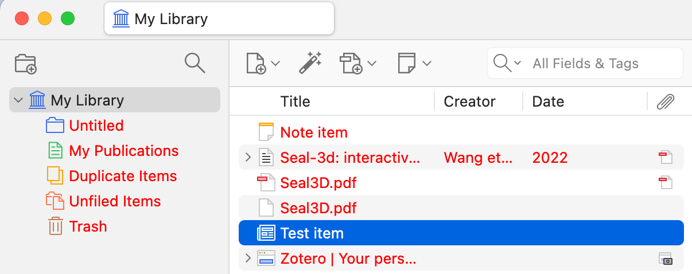
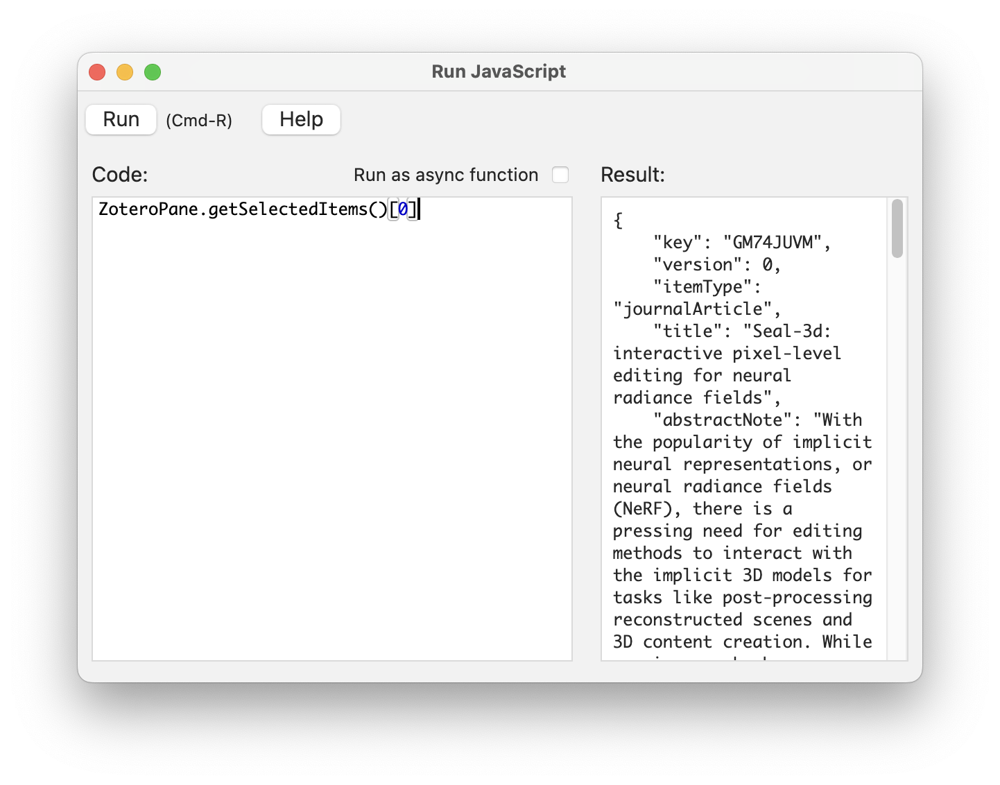
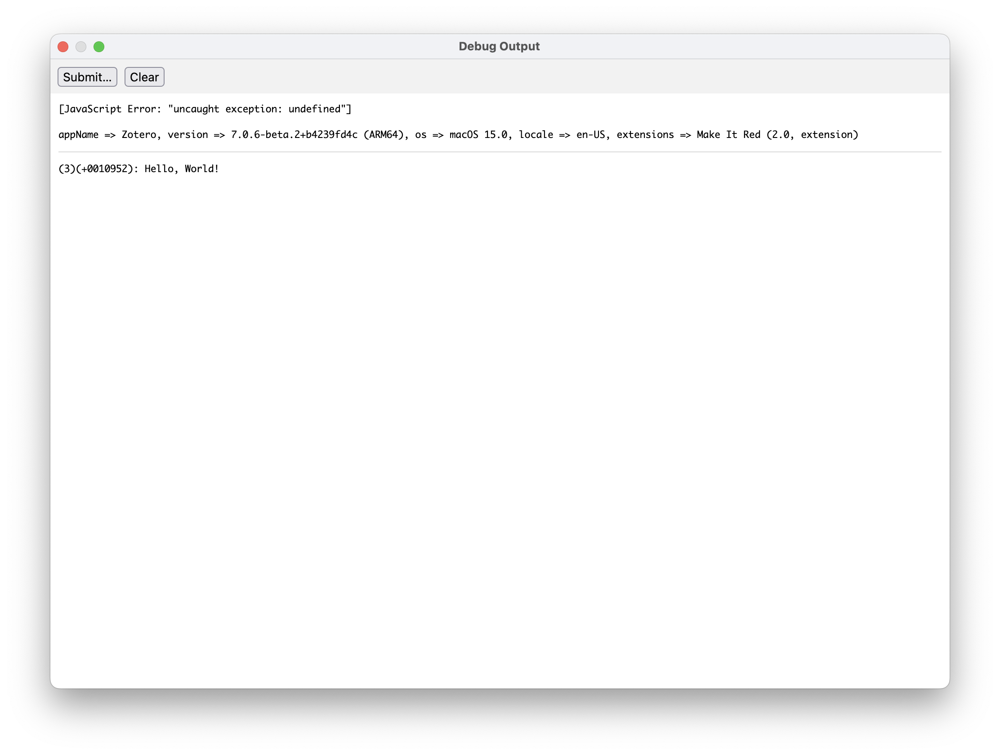
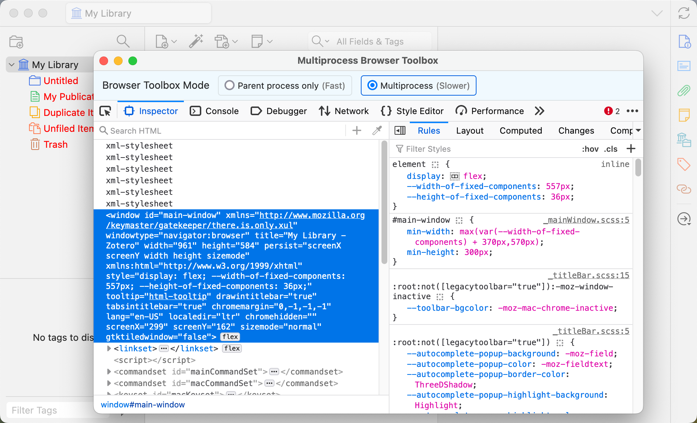
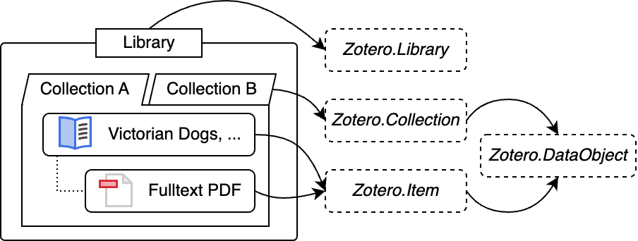
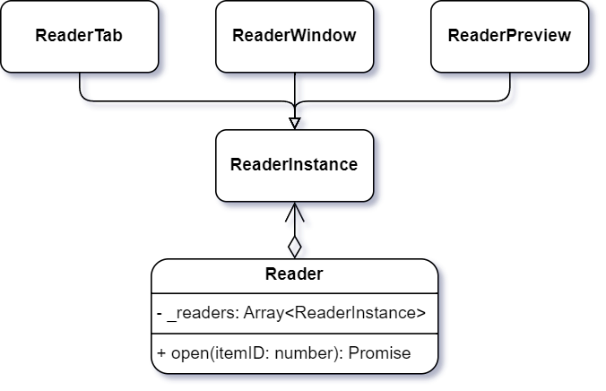

<!-- markdownlint-disable MD033 MD036 MD040 -->

# 1 Getting Started

## 1.1 What is Zotero Plugin

Plugins can customize the experience of using Zotero and enhance its capability by adding functions and features to Zotero.

The Zotero plugin has a similar structure of browser's web-extension, while developing a Zotero plugin is quite different from developing a browser extension. As a desktop application, Zotero allows plugins to be very flexible and powerful, like using Zotero database, accessing local files, and communicating with other applications.

## 1.2 Prerequisites

- Basic knowledge of web technologies, including [HTML](https://developer.mozilla.org/en-US/docs/Web/HTML), [CSS](https://developer.mozilla.org/en-US/docs/Web/CSS), and [JavaScript](https://developer.mozilla.org/en-US/docs/Web/JavaScript).
- A computer with [Zotero](https://www.zotero.org/download/) installed.
- And most importantly, a good idea of what you want to build!

## 1.3 Your First Plugin

In this section, we'll guide you through developing your first Zotero plugin. We'll use the official example plugin [Make-It-Red](https://github.com/zotero/make-it-red) as an example.

### 1.3.1 Developing the Plugin

Make sure you have [Git](https://git-scm.com/) and [NodeJS](https://nodejs.org/) installed and configured.

First, open the terminal and run the following code to clone the official plugin example repo make-it-red:

```bash
git clone git@github.com:zotero/make-it-red.git
```

Download necessary dependencies:

```bash
cd ./make-it-red
npm install
```

Run the following commands to build the plugin:

```bash
npm run build
```

The build results are `build/make-it-red-2.0.xpi`.

> 🔗 For Zotero plugins, we use `xpi` file extension. It is zipped with all the script files and resources. See [Plugin File Structure](#141-plugin-file-structure) for more details about the XPI file.

### 1.3.2 Running the Plugin

#### 1.3.2.1 Installing Manually

For plugin developers, it's always recommended to use [Beta Builds](https://www.zotero.org/support/beta_builds).

> 🔗 During the plugin development, it is strongly recommended to use a separate profile. You can follow [this document](https://www.zotero.org/support/kb/multiple_profiles) to create a new profile. Be cautious when developing plugins on profile with your important data!

In the menu bar, click `Tools` -> `Plugin` to open the _Plugins Manager_ window.

To install the plugin, from the settings (⚙️) menu in the Plugins Manager, click `Install Plugin From File...` and select the `xpi` file we just built. Alternatively, you can drag-drop the `xpi` file to the _Plugin Manager_ window.

After the plugin is successfully installed and enabled, you can see the text in the items list and the library list are turned to red, as indicated by the example plugin's name _Make-It-Red_.



#### 1.3.2.2 Loading from Source Code

It could be annoying to manually install the plugin every time you make a change. You can load the plugin from the source code directly. Every time you start Zotero, the plugin will be loaded using the latest code.

After creating your plugin's source directory with sample code, you can tell Zotero to load the plugin by creating an extension proxy file. (This is a technique that used to be possible for Firefox extension development, though it's since been discontinued in Firefox.)

1. Close Zotero.
2. Create a text file in the 'extensions' directory of your Zotero profile directory named after the extension id (e.g., `myplugin@mydomain.org`). The file contents should be the absolute path to the root of your plugin source code directory, where your `manifest.json` or `bootstrap.js` file is located.
3. Open `prefs.js` in the Zotero profile directory in a text editor and delete the lines containing `extensions.lastAppBuildId` and `extensions.lastAppVersion`. Save the file and restart Zotero. This will force Zotero to read the 'extensions' directory and install your plugin from source, after which you should see it listed in Tools → Add-ons. This is only necessary once.
4. Whenever you make changes to your plugin code, start up Zotero from the command line and pass the `-purgecaches` flag to force Zotero to re-read any cached files. (This may no longer be necessary with Zotero 7.) You'll likely want to make an alias or shell script that also includes the `-ZoteroDebugText` and `-jsconsole` flags and perhaps `-p <Profile>`, where `<Profile>` is the name of a development profile.

> 💡 Try this out!
>
> After setting up the development environment, make a change to the plugin code and see the result in Zotero.
> Let's _make it blue_, instead of red.
>
> 1. Open `src/style.css`, change the `color: red;` in line 2 to `color: blue`.
> 2. Run `npm run build` again, then install the plugin again manually.
> 3. Quit (Ctrl/Cmd + Q) and restart Zotero
> 4. You will see the text in the items list and the library list are turned to blue now.

### 1.3.3 Debugging the Plugin

#### 1.3.3.1 _Run JavaScript_ Window

To run JavaScript in Zotero, the easiest way is using the _Run JavaScript_ window.

In the menu bar, click `Tools` -> `Developer` -> `Run JavaScript`. Type the code in the left panel and click `Run` to execute. The result will be shown on the right panel.

> 💡 Try this out!
>
> Select an item in the library, then run `ZoteroPane.getSelectedItems()[0]` in the _Run JavaScript_ window.



> 🔗 For more details about the _Run JavaScript_ window, see [Running Ad Hoc JavaScript in Zotero](https://www.zotero.org/support/dev/client_coding/javascript_api#running_ad_hoc_javascript_in_zotero).

#### 1.3.3.2 Debug Output

Zotero has a built-in debug output system that are more friendly to users for providing feedback and debugging information.

Plugin developers can use the `Zotero.debug` function to output messages to the debug console. The debug console can be opened by clicking `Help` -> `Debug Output Logging` -> `View Output`.

> 💡 Try this out!
>
> Run `Zotero.debug("Hello, World!")` in the _Run JavaScript_ window and check the debug output.



> 🔗 For more details about using the debug output, see [Debug Output Logging](https://www.zotero.org/support/debug_output#zotero).

Although it's not possible for plugin developers to access users' debug output using the Debug ID, you can ask users to enable debug output, reproduce the issue, and send you the debug output.

#### 1.3.3.3 DevTools

Since Zotero is based on Firefox, it's possible to use the Firefox Developer Tools to interact with the DOM, set code breakpoints, follow network requests, and more.

> 🔗 For more details about the devtools, see [Firefox DevTools User Docs](https://firefox-source-docs.mozilla.org/devtools-user/).

Zotero 7 beta builds include the Firefox 115 devtools. To start a beta build with the Browser Toolbox open, pass the `-jsdebugger` flag on the command line:

```bash
# the /path/to/zotero is the path to the Zotero executable
# For MacOS:
# /Applications/Zotero.app/Contents/MacOS/zotero
# For Windows:
# C:\Program Files (x86)\Zotero\zotero.exe
/path/to/zotero -ZoteroDebugText -jsdebugger
```

When running Zotero from source, passing `-d` flag to the [build_and_run script](https://www.zotero.org/support/dev/client_coding/building_the_desktop_app#helper_script "dev:client_coding:building_the_desktop_app") will rebuild (`-r`) with the devtools included and pass `-jsdebugger`.



> 💡 Try this out!
>
> Run `Zotero.getMainWindow().console.log("Hello, World!")` from the Run JS window and check the devtools' console.

### 1.3.4 Conclusion

In section 1.3, we introduced how to develop your first Zotero plugin, run the plugin, and debug the plugin. We also provided some tips for debugging the plugin.

By now, you should have a basic understanding of how to run the example plugin and how to debug it. You might still don't know how to create the features you want, but don't worry, we'll cover that in the following sections.

In section 1.4, we'll introduce the anatomy of a Zotero plugin, so that you can have an overview of the plugin structure and how it works.

## 1.4 Plugin Anatomy

In this section, we'll introduce the structure of a Zotero plugin, including the plugin file structure and the update mechanism.

### 1.4.1 Plugin File Structure

A plugin consists of a collection of files, packaged for distribution and installation. It is similar to a web extension, but with some differences.

#### 1.4.1.1 manifest.json

The `manifest.json` file is the metadata file for the plugin. It contains the plugin's name, version, description, and other information.

This file must be in the root directory of the plugin.

Here is an example of a `manifest.json` file:

```json
{
  "manifest_version": 2,
  "name": "Make It Red",
  "version": "2.0",
  "description": "Makes everything red",
  "homepage_url": "https://github.com/zotero/make-it-red",
  "applications": {
    "zotero": {
      "id": "make-it-red@example.com",
      "update_url": "https://zotero-download.s3.amazonaws.com/tmp/make-it-red/updates-2.0.json",
      "strict_min_version": "6.999",
      "strict_max_version": "7.0.*"
    }
  }
}
```

Explanation of the fields in the `manifest.json` file are as follows. The fields marked with `*` are required.

- `manifest_version`\*: The version of the manifest file format. Currently, the only valid value is `2`.
- `name`\*: The name of the plugin.
- `version`\*: The version of the plugin. The version number should follow [this](https://developer.mozilla.org/en-US/docs/Mozilla/Add-ons/WebExtensions/manifest.json/version) format.
- `description`: A brief description of the plugin. It will be shown in the _Plugin Manager_.
- `homepage_url`: The URL of the plugin's homepage. It will be shown in the _Plugin Manager_.
- `applications/zotero`\*: The application-specific information. It is based on [browser_specific_settings.gecko](https://developer.mozilla.org/en-US/docs/Mozilla/Add-ons/WebExtensions/manifest.json/browser_specific_settings) and must be present for Zotero to install your plugin.
  - `id`\*: The unique identifier for the plugin. It should be in the format of `myplugin@mydomain.org`.
  - `update_url`: The URL of the update manifest. See also [Plugin Update](#142-plugin-update).
  - `strict_min_version`: The minimum version of Zotero that the plugin is compatible with. You should set it to `x.x.*` of the latest Zotero minor version that you have tested your plugin with.
  - `strict_max_version`: The maximum version of Zotero that the plugin is compatible with.

#### 1.4.1.2 bootstrap.js

The `bootstrap.js` file is the main script file for the plugin. It is executed in the plugin's lifecycle, such as when the plugin is loaded, unloaded, or updated. It must be in the root directory of the plugin.

A `bootstrap.js` file containing functions to handle various events:

- Plugin lifecycle hooks
- Window hooks

> 🔗 For more details, see [Plugin Lifecycle](#21-plugin-lifecycle).

**Plugin lifecycle hooks**

Plugin lifecycle hooks are modeled after the legacy Mozilla [bootstrapped-extension framework](http://www.devdoc.net/web/developer.mozilla.org/en-US/docs/Mozilla/Add-ons/Bootstrapped_Extensions.html#Bootstrap_entry_points "http://www.devdoc.net/web/developer.mozilla.org/en-US/docs/Mozilla/Add-ons/Bootstrapped_Extensions.html#Bootstrap_entry_points"):

- `startup()`
- `shutdown()`
- `install()`
- `uninstall()`

Plugin lifecycle hooks are passed two parameters:

- An object with these properties:
  - `id`, a string of the plugin id
  - `version`, a string of the plugin version
  - `rootURI`, a string URL pointing to the plugin's files. For XPIs, this will be a `jar:file:///` URL. This value will always end in a slash, so you can append a relative path to get a URL for a file bundled with your plugin (e.g., `rootURI + 'style.css'`).
- A number representing the reason for the event, which can be checked against the following constants: `APP_STARTUP`, `APP_SHUTDOWN`, `ADDON_ENABLE`, `ADDON_DISABLE`, `ADDON_INSTALL`, `ADDON_UNINSTALL`, `ADDON_UPGRADE`, `ADDON_DOWNGRADE`

Any initialization unrelated to specific windows should be triggered by `startup`, and removal should be triggered by `shutdown`.

The `install()` and `startup()` bootstrap methods are called only after Zotero has initialized, and the `Zotero` object is automatically made available in the bootstrap scope, along with `Services`, `Cc`, `Ci`, and other Mozilla and browser objects.

Bootstrapped plugins can be disabled or uninstalled without restarting Zotero, so you'll need to make sure you remove all functionality in the `shutdown()` function.

**Window Hooks**

Window hooks, available only in Zotero 7, are called on the opening and closing of the main Zotero window:

- `onMainWindowLoad()`
- `onMainWindowUnload()`

Window hooks are passed one parameter:

- An object with a `window` property containing the target window

Main windows might already be opened when the plugin is loaded, in which case `onMainWindowLoad` will not be called for those windows. You should always check for the existence of any main windows and call it manually if necessary.

```javascript
// In bootstrap.js
async function startup(data, reason) {
  // Do any initialization that should happen when the plugin is loaded

  // After initialization, call onMainWindowLoad for any existing main windows
  await Promise.all(
    Zotero.getMainWindows().map((win) => onMainWindowLoad(win))
  );
}
```

On some platforms, the main window can be opened and closed multiple times during a Zotero session, so any window-related activities, such as modifying the main UI, adding menus, or binding shortcuts must be performed by `onMainWindowLoad` so that new main windows contain your changes.

You must then **remove all references to a window or objects within it, cancel any timers, etc.**, when `onMainWindowUnload` is called, or else you'll risk creating a memory leak every time the window is closed. DOM elements added to a window will be automatically destroyed when the window is closed, so you only need to remove those in `shutdown()`, which you can do by cycling through all windows:

```javascript
function shutdown() {
  let windows = Zotero.getMainWindows();
  for (let win of windows) {
    win.document.getElementById("make-it-red-stylesheet")?.remove();
  }
}
```

> Currently, only one main window is supported, but some users may find ways to open multiple main windows, and this will be officially supported in a future version.

Some plugins may require additional hooks in Zotero itself to work well as bootstrapped plugins. If you're having trouble accomplishing something you were doing previously via XUL overlays, let us know on [zotero-dev](https://groups.google.com/g/zotero-dev "https://groups.google.com/g/zotero-dev").

#### 1.4.1.3 Locale

Mozilla has introduced a new localization system called [Fluent](https://projectfluent.org/ "https://projectfluent.org/"), which replaces both `.dtd` and `.properties` localization. While both `.dtd` and `.properties` are still supported in the current version of Zotero 7, `.dtd` files and `.properties` files will be remove in the future. To ensure future compatibility, plugin should aim to use Fluent for localization going forward.

See the [Fluent Syntax Guide](https://projectfluent.org/fluent/guide/ "https://projectfluent.org/fluent/guide/") for more information on creating Fluent files.

**Registering Fluent Files**

To use Fluent in your plugin, create a `locale` folder in your plugin root with subfolders for each locale, and place `.ftl` files within each locale folder:

```
locale/en-US/make-it-red.ftl
locale/fr-FR/make-it-red.ftl
locale/zh-CN/make-it-red.ftl
```

Any `.ftl` files you place in the locale subfolders will be automatically registered in Zotero's localization system.

All supported locales are list in [locales](https://github.com/zotero/zotero/tree/main/chrome/locale).

**Using a Fluent File in a Document**

Fluent files you include with your plugin can be applied to a document with a `<link>` element.

For example, a Fluent file located at

```
[plugin root]/locale/en-US/make-it-red.ftl
```

could be included in an XHTML file as

```html
<link rel="localization" href="make-it-red.ftl" />
```

If the document's default namespace is XUL, include HTML as an alternative namespace (`xmlns:html="http://www.w3.org/1999/xhtml"`) and prefix the link:

```html
<html:link rel="localization" href="make-it-red.ftl" />
```

If modifying an existing window, you can create a `<link>` element dynamically:

```javascript
MozXULElement.insertFTLIfNeeded("make-it-red.ftl");
```

(`MozXULElement` will be a property of the window you're modifying.)

Please ensure that you have inserted the FTL into the window before making any changes to the DOM.

If adding to an existing window, be sure to remove the `<link>` in your plugin's `shutdown` function:

```javascript
doc.querySelector('[href="make-it-red.ftl"]').remove();
```

### 1.4.2 Plugin Update

The update manifests are set up to demonstrate upgrading across all versions, but normally a plugin would point to a single update manifest that was updated as new versions were available.

Zotero uses a [Mozilla-style JSON update manifest](https://extensionworkshop.com/documentation/manage/updating-your-extension/ "https://extensionworkshop.com/documentation/manage/updating-your-extension/").

The update manifest JSON is not included in the plugin XPI file. It should be hosted online, and the URL should be specified in the plugin's `update_url` field in the `manifest.json` file of the plugin.

Here is the official plugin example's update manifest:

```json
{
  "addons": {
    // The plugin id
    "make-it-red@zotero.org": {
      "updates": [
        {
          "version": "2.0", // The version of the plugin
          "update_link": "https://download.zotero.org/plugins/make-it-red/make-it-red-2.0.xpi", // The URL of the XPI file
          "update_hash": "sha256:4a6dd04c197629a02a9c6beaa9ebd52a69bb683f8400243bcdf95847f0ee254a", // The hash of the XPI file
          "applications": {
            "zotero": {
              "strict_min_version": "6.999" // The minimum version of Zotero that the plugin is compatible with
            }
          }
        }
      ]
    }
  }
}
```

# 2 Concepts

In this section, we'll introduce some key concepts of Zotero plugin development, including the plugin lifecycle, Zotero data model, persisted settings, notifier events, privileged v.s unprivileged, and reader.

## 2.1 Plugin LifeCycle

Each plugin goes through a lifecycle, from being loaded to being unloaded. During this lifecycle, it runs a series of hooks that allow the plugin to perform actions at specific points in time.

| Hook                 | Called when...                                                                   | Description                                                                                      |
| -------------------- | -------------------------------------------------------------------------------- | ------------------------------------------------------------------------------------------------ |
| `install`            | Called when the plugin is manually installed or updated                          | Perform any necessary setup. Should not be used for actual tasks. The plugin is not yet running. |
| `startup`            | Called when the plugin is loaded                                                 | Perform any necessary initialization. The plugin is now running.                                 |
| `shutdown`           | Called when the plugin is unloaded                                               | Perform any necessary cleanup. The plugin will not be running.                                   |
| `uninstall`          | Called when the plugin is manually uninstalled                                   | Perform any necessary cleanup. The plugin is no longer running.                                  |
| `onMainWindowLoad`   | Called when the main Zotero main window is opened. May be called multiple times. | Perform any necessary initialization for the main window. The window is now open.                |
| `onMainWindowUnload` | Called when the main Zotero main window is closed. May be called multiple times. | Perform any necessary cleanup for the main window. The window is now closed.                     |

The figure below shows the lifecycle of a plugin and how the hooks are called.


> 💡 Try this out!
>
> Add the following line to the `bootstrap.js` file's `startup()` function of the example plugin, then apply the changes and restart Zotero with debug output enabled.
>
> ```javascript
> Zotero.debug("Hello, World! The plugin is loaded.");
> ```
>
> Check the debug output to see if the message is printed when the plugin is loaded.
>
> Disable and then enable the plugin in the _Plugins Manager_ to see if the message is printed again.

## 2.2 Zotero Data Model

Zotero has a unified data model that represents all types of data in Zotero.

For developers, the data model is based on the concept of data objects, which are instances of classes that represent different types of data.

For example, a PDF file will be represented by an attachment `Item` object (instance of `Zotero.Item`), which usually belongs to a regular `Item` object (instance of `Zotero.Item`). This item can be in multiple `Collection` objects (instance of `Zotero.Collection`). Eventually, all these data objects are stored in a `Library` (instance of `Zotero.Library`).

This relation can be described as follows:



Each data class has a corresponding object for managing instances of the class. For example, `Zotero.Items` is the object for managing `Zotero.Item` instances. You can use these plural objects to create, retrieve, update, and delete the corresponding data objects.

For example, you can get a `Zotero.Item` instance by its key using the object `Zotero.Items`:

```javascript
let item = await Zotero.Items.getAsync(itemID);
```

> ❓ What is the difference between `getAsync` and `get`?
>
> The `getAsync` method is an asynchronous method that returns a promise, while the `get` method is a synchronous method that returns the object directly. The asynchronous method ensures that the objects are loaded.
>
> For most cases, it is recommended to use the asynchronous method.

The table below shows the class and its corresponding plural object:

| Class               | Manager Object       |
| ------------------- | -------------------- |
| `Zotero.DataObject` | `Zotero.DataObjects` |
| `Zotero.Collection` | `Zotero.Collections` |
| `Zotero.Search`     | `Zotero.Searches`    |
| `Zotero.Item`       | `Zotero.Items`       |
| `Zotero.FeedItem`   | `Zotero.FeedItems`   |
| `Zotero.Library`    | `Zotero.Libraries`   |
| `Zotero.Group`      | `Zotero.Groups`      |
| `Zotero.Feed`       | `Zotero.Feeds`       |

### 2.2.1 Library

All items and collections in Zotero belongs to a **Library**. There are three types of libraries in Zotero:

- User Library
- Group
- Feed

Each library has a unique `id` and, which can be used to get the library instance.

The user library is the default library that contains all the items and collections created by the user. The user library ID can be retrieved using `Zotero.Libraries.userLibraryID`.

```javascript
// The user library ID
let libraryID = Zotero.Libraries.userLibraryID;
// Get the library by ID
let library = await Zotero.Libraries.getAsync(libraryID);
// Print the library ID
Zotero.debug(library.id);
// Print the library type, which is "user" for the user library.
// Can be "group" or "feed" for other types of libraries.
Zotero.debug(library.type);
```

You can get all the libraries using `Zotero.Libraries.getAll()`.

### 2.2.2 Data Object

The `Zotero.DataObject` class is the base class for all data objects, including `Zotero.Collection`, `Zotero.Item`, `Zotero.Search`.

Each data object has a unique `key` (string) and a `id` (number).

> ❗️ Do not rely on the `id` for identifying the data object!
>
> The `key` is unique across all devices, while the `id` is unique within the local database. In extreme cases, the `id` can be changed, but the `key` always remain the same.

Other important shared properties and methods include:

- `libraryID`: indicates which library the data object belongs to.
- `objectType`: indicates the type of the data object. Can be `collection`, `item`, `search`, etc.
- `version`: indicates the version of the data object. The version is incremented every time the data object is updated.
- `deleted`: indicates whether the data object is trashed.
- `save()` and `saveTx()`: saves the changes to the database.
- `erase()` and `eraseTx()`: completely erase the data object from the database.

To create a new data object, you can use the `new` keyword. For example, to create a new item:

```javascript
let item = new Zotero.Item();
```

Each time you modify a data object, you should call the `save()` or `saveTx()` method to save the changes to the database. We'll cover this in more detail in the following sections.

> ❓ What is the difference between `save()` and `saveTx()`?
>
> The `saveTx()` creates a transaction for saving the changes, while the `save()` should be called inside a transaction. For multiple changes in one transaction, they will be saved together when the transaction is committed.
>
> The `save()` is useful when you have multiple changes to save together.
>
> For `erase()` and `eraseTx()`, the same principle applies.

Besides the shared properties and methods, different types of data objects have their own properties and methods. The inheritance relationship is shown in the following UML diagram:


We'll discuss the different types of data objects in the following sections.

### 2.2.3 Collection

A **Collection** contains a group of items and other collections.

Besides the shared properties and methods of a data object, a collection object has the following important properties:

- `name`: the name of the collection.
- `parent`: the parent collection of the collection. If the collection is a top-level collection, the parent is `null`.
- `parentKey`: the key of the parent collection.
- `parentID`: the ID of the parent collection.
- `getChildCollections()`: gets the child collections of the collection.
- `getChildItems()`: gets the items in the collection.
- `addItem()`/`addItems()`: adds an item or items to the collection.
- `removeItem()`/`removeItems()`: removes an item or items from the collection.

The `Zotero.Collections` object is used to manage collection objects. Here are some examples of how to use the `Zotero.Collections` object:

```javascript
// Get all collections in the user library
let collections = Zotero.Collections.getByLibrary(
  Zotero.Libraries.userLibraryID
);
// Get the collection by key
let collection = Zotero.Collections.getByLibraryAndKey(
  Zotero.Libraries.userLibraryID,
  collections[0].key
);
// Get the collection by ID
collection = Zotero.Collections.get(collection.id);
// Get child items of the collection
let itemIDs = collection.getChildItems().map((item) => item.id);
// Get collections containing the items
collections = await Zotero.Collections.getCollectionsContainingItems(itemIDs);
```

### 2.2.4 Search

The **Search** object is used to search for items in a library. It has the following properties and methods:

- `addCondition(field, operator, value, required): number`: adds a search condition.
- `updateCondition(searchConditionID, condition, operator, value, required): void`: updates a search condition.
- `removeCondition(searchConditionID): void`: removes a search condition.
- `getCondition(searchConditionID): ConditionType`: gets a search condition. Returns an array of `ConditionType` (object with `condition`, `operator`, `value`, `required` properties).
- `getConditions(): { [id: number]: ConditionType }`: gets all search conditions.
- `search(asTempTable): Promise<number[]> | Promise<string>`: executes the search.

<details>
<summary>All available operators and conditions</summary>

Be aware that the available operators and conditions are subject to change. Some operators and conditions are only supposed to be used internally.

```typescript
type Operator =
  | "is"
  | "isNot"
  | "true"
  | "false"
  | "isInTheLast"
  | "isBefore"
  | "isAfter"
  | "contains"
  | "doesNotContain"
  | "beginsWith"
  | "isLessThan"
  | "isGreaterThan"
  | "any"
  | "all"
  | "true"
  | "false";
type Conditions =
  | "numPages"
  | "numberOfVolumes"
  | "abstractNote"
  | "anyField"
  | "accessDate"
  | "applicationNumber"
  | "archive"
  | "artworkSize"
  | "assignee"
  | "fulltextContent"
  | "fileTypeID"
  | "author"
  | "authority"
  | "bookAuthor"
  | "callNumber"
  | "childNote"
  | "citationKey"
  | "code"
  | "codeNumber"
  | "collection"
  | "committee"
  | "conferenceName"
  | "country"
  | "creator"
  | "date"
  | "dateAdded"
  | "dateModified"
  | "DOI"
  | "edition"
  | "editor"
  | "extra"
  | "filingDate"
  | "history"
  | "ISBN"
  | "ISSN"
  | "issue"
  | "itemType"
  | "journalAbbreviation"
  | "language"
  | "libraryCatalog"
  | "archiveLocation"
  | "medium"
  | "meetingName"
  | "note"
  | "number"
  | "pages"
  | "place"
  | "priorityNumbers"
  | "programmingLanguage"
  | "publicationTitle"
  | "publisher"
  | "references"
  | "reporter"
  | "rights"
  | "runningTime"
  | "scale"
  | "section"
  | "series"
  | "seriesNumber"
  | "seriesText"
  | "seriesTitle"
  | "session"
  | "shortTitle"
  | "status"
  | "system"
  | "tag"
  | "title"
  | "type"
  | "url"
  | "versionNumber"
  | "volume"
  | "deleted"
  | "noChildren"
  | "unfiled"
  | "retracted"
  | "publications"
  | "feed"
  | "includeParentsAndChildren"
  | "includeParents"
  | "includeChildren"
  | "recursive"
  | "joinMode"
  | "quicksearch-titleCreatorYear"
  | "quicksearch-titleCreatorYearNote"
  | "quicksearch-fields"
  | "quicksearch-everything"
  | "quicksearch"
  | "blockStart"
  | "blockEnd"
  | "collectionID"
  | "savedSearchID"
  | "savedSearch"
  | "itemTypeID"
  | "tagID"
  | "lastName"
  | "field"
  | "datefield"
  | "year"
  | "numberfield"
  | "libraryID"
  | "key"
  | "itemID"
  | "annotationText"
  | "annotationComment"
  | "fulltextWord"
  | "tempTable";
```

</details>

### 2.2.5 Item

The `Item` is the most common data object in Zotero. Some important types of items include:

- Regular Item: A bibliographic item, such as a book, article, or webpage.
- Attachment Item: An attachment, such as a PDF file, a snapshot, or a image in the note.
- Note Item: A note item.
- Annotation Item: An annotation item. It always belongs to an attachment item.

> 📖 Terminology: Child Item v.s Standalone Item
>
> A child item is an item that has a parent item, such as an attachment item has a parent regular item. A standalone item is an item that does not have a parent item.

The `Item` object has the following important properties and methods:

- `itemType`: the type of the item. For example, `book`, `journalArticle`, `attachment`, `note`, etc.
- `parentItem`: the parent item of the item. If the item is a standalone item, the parent item is `null`.
- `topLevelItem`: the top-level item of the item. If the item is a standalone item, the top-level item is the item itself.
- `isTopLevelItem()`: indicates whether the item is a top-level item.
- `isRegularItem()`: indicates whether the item is a regular item.
- `isAttachment()`: indicates whether the item is an attachment item.
- `isAnnotation()`: indicates whether the item is an annotation item.
- `isNote()`: indicates whether the item is a note item.
- `numChildren()`: gets the number of child items of the item.
- `getTags()`: gets the tags of the item.
- `setTags()`: sets the tags of the item.
- `replaceTag()`: replaces the tags of the item.
- `addTag()`: adds a tag to the item.
- `removeTag()`: removes a tag from the item.
- `addToCollection()`: adds the item to a collection.
- `getCollections()`: gets the collections containing the item.
- `setCollections()`: sets the collections containing the item.
- `inCollection()`: indicates whether the item is in a collection.
- `clone()`: returns an unsaved copy of the item without itemID and key.
- `moveToLibrary()`: moves the item to another library.

For Regular Items, the following additional properties and methods would be useful:

- `getField()`: gets the value of a field of the item.
- `setField()`: sets the value of a field of the item.
- `getAttachments()`: gets the attachments of the item.
- `getBestAttachment()`: gets the best attachment of the item. Looks for attachment in the following order: oldest PDF attachment matching parent URL, oldest PDF attachment not matching parent URL, oldest non-PDF attachment matching parent URL, and old non-PDF attachment not matching parent URL.
- `getNotes()`: gets the notes of the item.
- `numAttachments()`: gets the number of child attachments of the item.
- `numNotes()`: gets the number of child notes of the item.
- `addRelatedItem()`: adds a related item to the item.
- `removeRelatedItem()`: removes a related item from the item.

For Attachment Items, the following additional properties and methods would be useful:

- `attachmentFilename`: the filename of the attachment.
- `attachmentPath`: the raw attachment path string as stored in DB (e.g., "storage:foo.pdf", "attachments:foo/bar.pdf", "/Users/foo/Desktop/bar.pdf"). Can be set as absolute path or prefixed string ("storage:foo.pdf").
- `attachmentContentType`: the content type of the attachment. For example, `application/pdf`, `text/html`, `application/epub+zip`, etc.
- `attachmentText`: the text content of the attachment. Currently works on HTML, PDF and plaintext attachments.
- `isPDFAttachment()`: indicates whether the item is a PDF attachment.
- `isSnapshotAttachment()`: indicates whether the item is a snapshot (Webpage) attachment.
- `isEPUBAttachment()`: indicates whether the item is an EPUB attachment.
- `getFilePath()`/`getFilePathAsync()`: gets the file path of the attachment.
- `fileExists()`: indicates whether the file of the attachment exists.
- `renameAttachmentFile()`: renames the file of the attachment.
- `getAnnotations()`: gets the child annotations of the attachment.

For Note Items, the following additional properties and methods would be useful:

- `getNote()`: gets the note content.
- `setNote()`: sets the note content.
- `getNoteTitle()`: gets the note title.

For Annotation Items, the following additional properties and methods would be useful:

- `annotationType`: the type of the annotation. For example, `highlight`, `text`, `image`, `ink`, `note` (sticky note, not the note item), etc.
- `annotationText`: the text content of the annotation.
- `annotationComment`: the comment of the annotation.

To trash an item, you can use `Zotero.Items.trash()`/`Zotero.Items.trashTx()`.

```javascript
let item = await Zotero.Items.getAsync(itemID);
await Zotero.Items.trashTx(item);
```

## 2.3 Persisted Settings

## 2.4 Notifier Events

## 2.5 Privileged v.s Unprivileged

## 2.6 Reader

### 2.6.1 `Reader` vs `ReaderInstance`



### 2.6.2 Views

#### 2.6.2.1 Snapshot View

#### 2.6.2.2 ePub View

#### 2.6.2.3 PDF View

# 3 UX Guidelines

## 3.1 Zotero Pane

### 3.1.1 Collections Pane

### 3.1.2 Items Pane

### 3.1.3 Item Pane and Context Pane

## 3.2 Tabs

## 3.3 Reader

## 3.3 Note Editor

## 3.4 Dark Mode

# 4 Best Practice

## 4.1 Item Tree API

## 4.2 Preference Page API

## 4.3 Item Pane Section API

## 4.4 Reader UI API

## 4.5 Window Menu

## 4.6 HTTP Request

## 4.7 Worker

## 4.8 File I/O

## 4.9 Search

If you are focused on data access, the first thing you will want to do will be to retrieve items from your Zotero library. Creating an in-memory search is a good start.

```javascript
let s = new Zotero.Search();
s.libraryID = Zotero.Libraries.userLibraryID;
```

**Search for items containing a specific tag**

Starting with the above code, we then use the following code to retrieve items in My Library with a particular tag:

```javascript
s.addCondition("tag", "is", "tag name here");
let itemIDs = await s.search();
```

**Advanced searches**

```javascript
let s = new Zotero.Search();
s.libraryID = Zotero.Libraries.userLibraryID;
s.addCondition("joinMode", "any"); // joinMode defaults to 'all' as per the advanced search UI
```

To add the other conditions available in the advanced search UI, use the following:

```javascript
s.addCondition("recursive", "true"); // equivalent of "Search subfolders" checked
s.addCondition("noChildren", "true"); // "Only show top level children
s.addCondition("includeParentsAndChildren", "true");
("Include parent and child ...");
```

**Search by collection**

To search for a collection or a saved search you need to know the ID or key:

```javascript
s.addCondition("collectionID", "is", collectionID); // e.g., 52
s.addCondition("savedSearchID", "is", savedSearchID);

s.addCondition("collection", "is", collectionKey); // e.g., 'C72FDAP2'
s.addCondition("savedSearch", "is", savedSearchKey);
```

**Search by creator**

```javascript
let name = "smith";
s.addCondition("creator", "contains", name);
```

**Search by tag**

To search by tag, you use the tag text:

```javascript
let tagName = "something";
s.addCondition("tag", "is", tagName);
```

**Search by other fields**

The complete list of other fields available to search on is on the [search fields](https://www.zotero.org/support/dev/client_coding/javascript_api/search_fields "dev:client_coding:javascript_api:search_fields") page.

**Executing the search**

Once the search conditions have been set up, then it's time to execute the results:

```javascript
let itemIDs = await s.search();
```

This returns the item ids in the search as an array. The next thing to do is to get the Zotero items for the array of IDs:

```javascript
let items = await Zotero.Items.getAsync(itemIDs);
```
