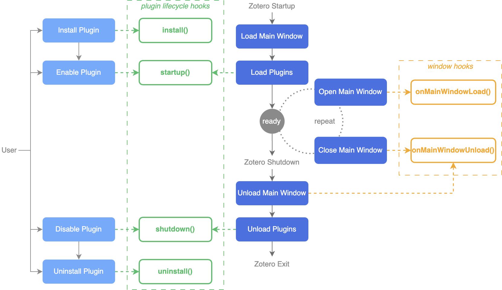

# Plugin Lifecycle

Every Zotero plugin follows a lifecycle, from installation to uninstallation. During this cycle, the plugin triggers a series of "hooks"—points in the plugin's execution where certain actions can be taken.

| Hook                 | Triggered when...                                                          | Description                                                                                        |
| -------------------- | -------------------------------------------------------------------------- | -------------------------------------------------------------------------------------------------- |
| `install`            | The plugin is installed or updated                                         | Set up initial configurations. This hook is only for setup tasks and the plugin isn't running yet. |
| `startup`            | The plugin is being loaded                                                 | Initialize everything needed for the plugin to function.                                           |
| `shutdown`           | The plugin is being unloaded                                               | Clean up resources before the plugin stops running.                                                |
| `uninstall`          | The plugin is being uninstalled or replaced by a newer installation        | Perform cleanup for uninstallation.                                                                |
| `onMainWindowLoad`   | The main Zotero window opens. Can happen multiple times during a session.  | Initialize UI changes for the main window.                                                         |
| `onMainWindowUnload` | The main Zotero window closes. Can happen multiple times during a session. | Remove any window-specific changes.                                                                |

The figure below illustrates the plugin lifecycle and the order in which the hooks are called.
The figure below shows the lifecycle of a plugin and how the hooks are called.



> 💡 Try this out!
>
> Add the following line to the `bootstrap.js` file's `startup()` function of the example plugin, then apply the changes and restart Zotero with debug output enabled.
>
> ```javascript
> Zotero.debug("Hello, World! The plugin is loaded.");
> ```
>
> Check the debug output to see if the message is printed when the plugin is loaded.
>
> Disable and then enable the plugin in the _Plugins Manager_ to see if the message is printed again.
