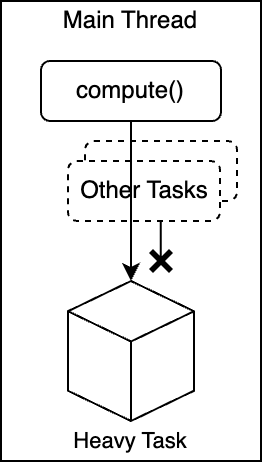
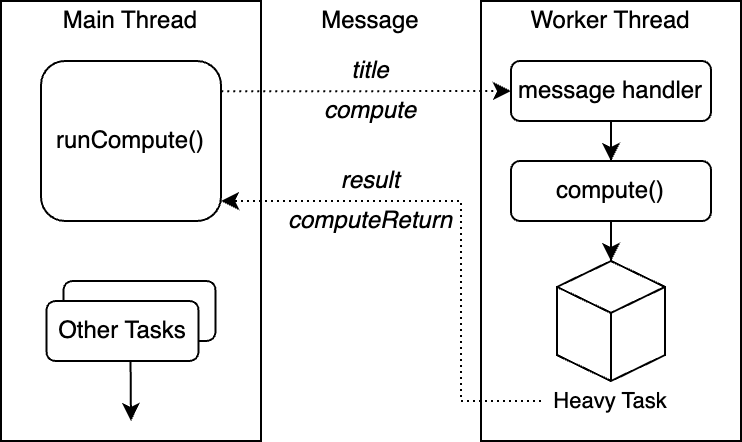
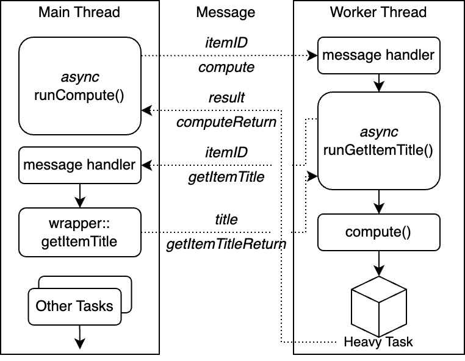

# Heavy Task with Web Worker

For heavy tasks that may block the main thread, plugins can use a [web worker](https://developer.mozilla.org/en-US/docs/Web/API/Web_Workers_API) to run the task in the background in a separate thread.

## Don't Block the Main Thread

For example, we have a heavy task that takes a long time to finish. It takes the item's title as input and shifts the characters by 1 in the ASCII table for each character for `10000000` times.

```javascript
function compute(title) {
  const startTimestamp = Date.now();
  let result = title;
  for (let i = 0; i < 10000000; i++) {
    result = result
      .split("")
      .map((c) => String.fromCharCode(c.charCodeAt(0) + 1))
      .join("");
  }
  const endTimestamp = Date.now();
  const time = endTimestamp - startTimestamp;
  return { result, time };
}

// Get the selected item
const item = Zotero.getActiveZoteroPane().getSelectedItems()[0];
// Get the title of the item
const title = item.getField("title");

// Run the heavy task
// DO NOT run this! It will block the main thread.
// let { result, time } = compute(title);
// Print the result and the time
// Zotero.debug(result);
// Zotero.debug(`Time: ${time} ms`);
```

If you run it in the main thread, it will block the UI and make the Zotero window unresponsive.



> ❗️ Be aware of the performance of the code. Do not run heavy tasks in the main thread. Freezing the UI is a bad user experience.

## Running Heavy Task in Web Worker

You may want to directly run the full code in the worker. However, the worker does not have access to the privileged APIs. It cannot access the item data directly.


To run the task in a web worker, you can create a new worker and run the task in the worker.

Suppose you have a worker script `worker.js`, which is registered at `chrome://myplugin/content/worker.js`.

```javascript
// worker.js

// Definition of the function `compute` is the same as above

// Listen to the message from the main thread
addEventListener("message", (event) => {
  const { type, jobID } = event.data;
  if (type === "compute") {
    const { title } = event.data;
    const { result, time } = compute(title);
    postMessage({
      type: "computeReturn",
      jobID,
      result,
      time,
    });
  }
});
```

In the main thread, you can create a new worker using the worker script.

```javascript
// In the plugin's code
const worker = new Worker("chrome://myplugin/content/worker.js");

// Receive the message from the worker
worker.addEventListener("message", (event) => {
  const { type } = event.data;
  if (type === "computeReturn") {
    const { result, time } = event.data;
    // Print the result and the time
    Zotero.debug(result);
    Zotero.debug(`Time: ${time} ms`);
  }
});

// Generate a random job ID, which is used to identify the job
function randomJobID() {
  return Math.random().toString(36).substring(2, 15);
}

/**
 * Run the heavy task in the worker
 * @param {string} title The title of the item
 * @returns {Promise<{ result: string, time: number }>} The result and the time of the task
 */
async function runCompute(title) {
  return new Promise((resolve) => {
    const jobID = randomJobID();
    // Send the message to the worker to run the heavy task
    worker.postMessage({ type: "compute", jobID, title });
    // Listen to the message from the worker
    worker.addEventListener("message", function handler(event) {
      const { type, jobID: returnJobID } = event.data;
      if (type !== "computeReturn" || returnJobID !== jobID) {
        return;
      }
      const { result, time } = event.data;
      // Remove the listener
      worker.removeEventListener("message", handler);
      resolve({ result, time });
    });
  });
}
```

Then you can call the `runCompute` function to run the heavy task in the worker and get the result in the main thread.

```javascript
// In the plugin's code

// Get the selected item
const item = Zotero.getActiveZoteroPane().getSelectedItems()[0];
// Get the title of the item
const title = item.getField("title");

// Run the heavy task in the worker
const { result, time } = await runCompute(title);
// Print the result and the time
Zotero.debug(result);
Zotero.debug(`Time: ${time} ms`);
```

The worker will run the task in the background and send the result back to the main thread. The main thread will receive the result and print it. The UI will not be blocked during the task.



## Variant: Accessing Zotero APIs in the Worker

The web worker does not have direct access to the privileged APIs. If you want to access privileged APIs in the worker, you can write a wrapper function in the main thread and call the function from the worker using message passing.

In this variant, when calling `compute` from the main thread, we want the worker to decide which item to process. We can send the item ID to the worker and let the worker request the item data from the main thread.

We use the parameter `itemID` to pass the item ID to the worker in the `compute` message. The worker will request the item data from the main thread by sending a message with the type `getItemTitle` and the item ID. The main thread will receive the message and send the item title back to the worker. After receiving the item title, the worker will run the `compute` task and send the result back to the main thread.

Let's first define the message handler for getting the item title and the corresponding wrapper function in the main thread.

```javascript
// In the plugin's code

// Wrapper function to get the item title
function getItemTitle(itemID) {
  const item = Zotero.Items.get(itemID);
  if (!item) {
    return null;
  }
  return item.getField("title");
}

// Same definition of the `worker`, `runCompute`, and `randomJobID` functions as above

// Listen to the message from the worker to handle the item title request
worker.addEventListener("message", (event) => {
  const { type, jobID: returnJobID } = event.data;
  if (type !== "getItemTitle" || returnJobID !== jobID) {
    return;
  }
  const { itemID } = event.data;
  const title = getItemTitle(itemID);
  postMessage({
    type: "getItemTitleReturn",
    jobID,
    title,
  });
});
```

Then, we can modify the worker script to request the item title from the main thread.

```javascript
// worker.js

// Generate a random job ID, which is used to identify the job
function randomJobID() {
  return Math.random().toString(36).substring(2, 15);
}

/**
 * Request the item title from the main thread
 * @param {number} itemID The ID of the item
 * @returns {Promise<string | null>} The title of the item
 */
async function runGetItemTitle(itemID) {
  return new Promise((resolve) => {
    const jobID = randomJobID();
    // Send the message to the main thread to get the item title
    postMessage({
      type: "getItemTitle",
      jobID,
      itemID,
    });
    // Listen to the message from the main thread
    addEventListener("message", function handler(event) {
      const { type, jobID: returnJobID } = event.data;
      if (type !== "getItemTitleReturn" || returnJobID !== jobID) {
        return;
      }
      const { title } = event.data;
      removeEventListener("message", handler);
      resolve(title);
    });
  });
}

// Listen to the message from the main thread
addEventListener("message", async (event) => {
  const { type, jobID } = event.data;
  if (type === "compute") {
    const { itemID } = event.data;
    // First, get the item title from the main thread
    const title = await runGetItemTitle(itemID);
    if (!title) {
      return;
    }
    // Then, run the heavy task
    const { result, time } = compute(title);
    // Finally, send the result back to the main thread
    postMessage({
      type: "computeReturn",
      jobID,
      result,
      time,
    });
  }
});
```

Now, you can call the `runCompute` function with the item ID to run the heavy task in the worker.

```javascript
// In the plugin's code

// Get the selected item
const item = Zotero.getActiveZoteroPane().getSelectedItems()[0];
// Get the item ID of the item
const itemID = item.id;

// Run the heavy task in the worker
const { result, time } = await runCompute(itemID);
// Print the result and the time
Zotero.debug(result);
Zotero.debug(`Time: ${time} ms`);
```

When you run the code, the worker will receive the item ID, request the item title from the main thread, run the heavy task, and send the result back to the main thread.


