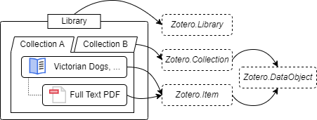
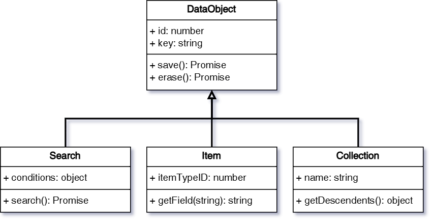

# Zotero Data Model

Zotero organizes data into different types of "data objects," which are instances of classes that represent various types of information in Zotero.

For example:

- A PDF file is represented by an attachment item object (an instance of `Zotero.Item`).
- This attachment item might have a parent item, which is a regular item (an instance of `Zotero.Item`).
- This regular item might belong to a collection (an instance of `Zotero.Collection`).
- All data objects are stored within a library (an instance of `Zotero.Library`).

This relation can be described as follows:



Each data class (like `Item` or `Collection`) has a corresponding "manager" object, which you can use to manage those instances. For example, to retrieve an `Item` object, you would use the `Zotero.Items` object:

```javascript
const item = await Zotero.Items.getAsync(itemID);
```

> ❓ What is the difference between `getAsync` and `get`?
>
> - `getAsync`: Asynchronous, ensures that the objects are loaded and returns a promise (recommended in most cases).
> - `get`: Synchronous, returns the object directly.

The table below lists the **class** and its corresponding plural **object**:

| Class               | Manager Object       |
| ------------------- | -------------------- |
| `Zotero.DataObject` | `Zotero.DataObjects` |
| `Zotero.Collection` | `Zotero.Collections` |
| `Zotero.Search`     | `Zotero.Searches`    |
| `Zotero.Item`       | `Zotero.Items`       |
| `Zotero.FeedItem`   | `Zotero.FeedItems`   |
| `Zotero.Library`    | `Zotero.Libraries`   |
| `Zotero.Group`      | `Zotero.Groups`      |
| `Zotero.Feed`       | `Zotero.Feeds`       |

## Library

All items and collections in Zotero belong to a **Library**. There are three types of libraries in Zotero:

- User Library
- Group
- Feed

Each library has a unique `id`, which can be used to retrieve the library instance.

The user library is the default library that contains all the items and collections created by the user. The user library ID can be retrieved using `Zotero.Libraries.userLibraryID`.

```javascript
// The user library ID
const libraryID = Zotero.Libraries.userLibraryID;
// Get the library by ID
const library = await Zotero.Libraries.getAsync(libraryID);
// Print the library ID
Zotero.debug(library.id);
// Print the library type, which is "user" for the user library.
// Can be "group" or "feed" for other types of libraries.
Zotero.debug(library.type);
```

You can get all the libraries using `Zotero.Libraries.getAll()`.

## Data Object

The `Zotero.DataObject` class is the base class for all data objects, including `Zotero.Collection`, `Zotero.Item`, and `Zotero.Search`.

Each data object has two key properties:

- `key`: A unique `string` identifier that stays the same across all devices in one library.
- `id`: A unique `number` in the local database.

> ❗️ Do not rely on the `id` for identifying the data object!
>
> The `key` is unique across all devices _(within a library)_, while the `id` is unique within the local database. In extreme cases, the `id` can be changed, but the `key` always remains the same.

Other important shared properties and methods include:

- `libraryID`: indicates which library the data object belongs to.
- `objectType`: identifies the type of the data object. Can be `collection`, `item`, `search`, etc.
- `version`: tracks the version of the data object, which increases with every update.
- `deleted`: indicates whether the data object is trashed.
- `save()` and `saveTx()`: saves the changes to the database.
- `erase()` and `eraseTx()`: completely erase the data object from the database.

To create a new data object, you can use the `new` keyword. For example, to create a new item:

```javascript
const item = new Zotero.Item();
```

After making changes, always call `save()` or `saveTx()` to store them. We'll cover this in more detail in later sections.

> ❓ What is the difference between `save()` and `saveTx()`?
>
> The `saveTx()` creates a transaction for saving the changes, while the `save()` should be called inside a [transaction](https://en.wikipedia.org/wiki/Database_transaction). For multiple changes in one transaction, they will be saved together when the transaction is committed.
>
> The `save()` is useful when you have multiple changes to save together.
>
> For `erase()` and `eraseTx()`, the same principle applies.

Besides the shared properties and methods, different types of data objects have additional properties and methods, as shown in the figure below:



We'll cover the different types of data objects in the following sections.

## Collection

A **Collection** contains items and can have sub-collections.

In addition to the inherited properties and methods from the `DataObject`, a collection object has the following key properties and methods:

- `name`: the name of the collection.
- `parent`: the parent collection of the collection. A top-level collection has a `null` parent.
- `parentKey`: the key of the parent collection.
- `parentID`: the ID of the parent collection.
- `getChildCollections()`: gets the child collections of the collection.
- `getChildItems()`: gets the items in the collection.
- `addItem()`/`addItems()`: adds an item or items to the collection.
- `removeItem()`/`removeItems()`: removes an item or items from the collection.

The `Zotero.Collections` object lets you manage collection objects. Here are some examples:

```javascript
// Get all collections in the user library
let collections = Zotero.Collections.getByLibrary(
  Zotero.Libraries.userLibraryID,
);
// Get the collection by key
let collection = Zotero.Collections.getByLibraryAndKey(
  Zotero.Libraries.userLibraryID,
  collections[0].key,
);
// Get the collection by ID
collection = Zotero.Collections.get(collection.id);
// Get child items of the collection
const itemIDs = collection.getChildItems().map((item) => item.id);
// Get collections containing the items
collections = await Zotero.Collections.getCollectionsContainingItems(itemIDs);
```

## Search

The **Search** allows plugins to search for items in a Zotero library. Plugins can define specific search conditions, execute the search, and retrieve results based on the set conditions.

Key properties and methods:

- `addCondition(field, operator, value, required): number`: adds a search condition.
- `updateCondition(searchConditionID, condition, operator, value, required): void`: updates a search condition.
- `removeCondition(searchConditionID): void`: removes a search condition.
- `getCondition(searchConditionID): ConditionType`: gets a search condition. Returns an array of `ConditionType` (object with `condition`, `operator`, `value`, `required` properties).
- `getConditions(): { [id: number]: ConditionType }`: gets all search conditions.
- `search(asTempTable): Promise<number[]> | Promise<string>`: executes the search.

<details>
<summary>All available operators and conditions</summary>

Be aware that the available operators and conditions are subject to change. Some operators and conditions are only supposed to be used internally.

```typescript
type Operator =
  | "is"
  | "isNot"
  | "true"
  | "false"
  | "isInTheLast"
  | "isBefore"
  | "isAfter"
  | "contains"
  | "doesNotContain"
  | "beginsWith"
  | "isLessThan"
  | "isGreaterThan"
  | "any"
  | "all"
  | "true"
  | "false";
type Conditions =
  | "numPages"
  | "numberOfVolumes"
  | "abstractNote"
  | "anyField"
  | "accessDate"
  | "applicationNumber"
  | "archive"
  | "artworkSize"
  | "assignee"
  | "fulltextContent"
  | "fileTypeID"
  | "author"
  | "authority"
  | "bookAuthor"
  | "callNumber"
  | "childNote"
  | "citationKey"
  | "code"
  | "codeNumber"
  | "collection"
  | "committee"
  | "conferenceName"
  | "country"
  | "creator"
  | "date"
  | "dateAdded"
  | "dateModified"
  | "DOI"
  | "edition"
  | "editor"
  | "extra"
  | "filingDate"
  | "history"
  | "ISBN"
  | "ISSN"
  | "issue"
  | "itemType"
  | "journalAbbreviation"
  | "language"
  | "libraryCatalog"
  | "archiveLocation"
  | "medium"
  | "meetingName"
  | "note"
  | "number"
  | "pages"
  | "place"
  | "priorityNumbers"
  | "programmingLanguage"
  | "publicationTitle"
  | "publisher"
  | "references"
  | "reporter"
  | "rights"
  | "runningTime"
  | "scale"
  | "section"
  | "series"
  | "seriesNumber"
  | "seriesText"
  | "seriesTitle"
  | "session"
  | "shortTitle"
  | "status"
  | "system"
  | "tag"
  | "title"
  | "type"
  | "url"
  | "versionNumber"
  | "volume"
  | "deleted"
  | "noChildren"
  | "unfiled"
  | "retracted"
  | "publications"
  | "feed"
  | "includeParentsAndChildren"
  | "includeParents"
  | "includeChildren"
  | "recursive"
  | "joinMode"
  | "quicksearch-titleCreatorYear"
  | "quicksearch-titleCreatorYearNote"
  | "quicksearch-fields"
  | "quicksearch-everything"
  | "quicksearch"
  | "blockStart"
  | "blockEnd"
  | "collectionID"
  | "savedSearchID"
  | "savedSearch"
  | "itemTypeID"
  | "tagID"
  | "lastName"
  | "field"
  | "datefield"
  | "year"
  | "numberfield"
  | "libraryID"
  | "key"
  | "itemID"
  | "annotationText"
  | "annotationComment"
  | "fulltextWord"
  | "tempTable";
```

</details>

## Item

The **Item** in Zotero represents different items in the Zotero library, like books, journal articles, or files. Here are some core concepts about items:

- Regular Item: A bibliographic item, such as a book, article, or webpage.
- Attachment Item: An attachment, such as a PDF file, a snapshot, or an image in the note.
- Note Item: A note item.
- Annotation Item: An annotation item. It always belongs to an attachment item.

> 📖 Terminology: Child Item v.s. Standalone Item
>
> A child item is an item that has a parent item, such as an attachment item with a parent regular item. A standalone item is an item that does not have a parent item. Attachment items may be either child items or standalone items.

Key properties and methods include:

- `itemType`: the type of the item. For example, `book`, `journalArticle`, `attachment`, `note`, etc.
- `parentItem`: the parent item of the item. A standalone item has a `null` parent.
- `topLevelItem`: the top-level item of the item. If the item is a standalone item, the top-level item is the item itself.
- `isTopLevelItem()`: indicates whether the item is a top-level item.
- `isRegularItem()`: indicates whether the item is a regular item.
- `isAttachment()`: indicates whether the item is an attachment item.
- `isAnnotation()`: indicates whether the item is an annotation item.
- `isNote()`: indicates whether the item is a note item.
- `numChildren()`: gets the number of child items of the item.
- `getTags()`: gets the tags of the item.
- `setTags()`: sets the tags of the item.
- `replaceTag()`: replaces the tags of the item.
- `addTag()`: adds a tag to the item.
- `removeTag()`: removes a tag from the item.
- `addToCollection()`: adds the item to a collection.
- `getCollections()`: gets the collections containing the item.
- `setCollections()`: sets the collections containing the item.
- `inCollection()`: indicates whether the item is in a collection.
- `clone()`: returns an unsaved copy of the item without itemID and key.
- `moveToLibrary()`: moves the item to another library.

For Regular Items, the following additional properties and methods would be useful:

- `getField()`: gets the value of a field of the item.
- `setField()`: sets the value of a field of the item.
- `getAttachments()`: gets the attachments of the item.
- `getBestAttachment()`: gets the best attachment of the item. Look for attachments in the following order: oldest PDF attachment matching parent URL, oldest PDF attachment not matching parent URL, oldest non-PDF attachment matching parent URL, and old non-PDF attachment not matching parent URL.
- `getNotes()`: gets the notes of the item.
- `numAttachments()`: gets the number of child attachments of the item.
- `numNotes()`: gets the number of child notes of the item.
- `addRelatedItem()`: adds a related item to the item.
- `removeRelatedItem()`: removes a related item from the item.

For Attachment Items, the following additional properties and methods would be useful:

- `attachmentFilename`: the filename of the attachment.
- `attachmentPath`: the raw attachment path string as stored in DB (e.g., "storage:foo.pdf", "attachments:foo/bar.pdf", "/Users/foo/Desktop/bar.pdf"). Can be set as an absolute path or prefixed string ("storage:foo.pdf").
- `attachmentContentType`: the content type of the attachment. For example, `application/pdf`, `text/html`, `application/epub+zip`, etc.
- `attachmentText`: the text content of the attachment. Currently works on HTML, PDF, and plaintext attachments.
- `isPDFAttachment()`: indicates whether the item is a PDF attachment.
- `isSnapshotAttachment()`: indicates whether the item is a snapshot (Webpage) attachment.
- `isEPUBAttachment()`: indicates whether the item is an EPUB attachment.
- `getFilePath()`/`getFilePathAsync()`: gets the file path of the attachment.
- `fileExists()`: indicates whether the file of the attachment exists.
- `renameAttachmentFile()`: renames the file of the attachment.
- `getAnnotations()`: gets the child annotations of the attachment.

For Note Items, the following additional properties and methods would be useful:

- `getNote()`: gets the note content.
- `setNote()`: sets the note content.
- `getNoteTitle()`: gets the note title.

For Annotation Items, the following additional properties and methods would be useful:

- `annotationType`: the type of the annotation. For example, `highlight`, `text`, `image`, `ink`, `note` (sticky note, not the note item), etc.
- `annotationText`: the text content of the annotation.
- `annotationComment`: the comment of the annotation.

To create a new item, you can use the `new` keyword. For example, to create a new regular item:

```javascript
// Create a new book item
const item = new Zotero.Item("book");

// Set the title and date fields
item.setField("title", "Much Ado About Nothing");
item.setField("date", "1599");

// Add a tag
item.addTag("Shakespeare");

// Save the item to the database
await item.saveTx();
```

After making changes, always call `save()` or `saveTx()` to store them.

To trash an item, you can use `Zotero.Items.trash()`/`Zotero.Items.trashTx()`.

```javascript
// Get the item by ID
const item = await Zotero.Items.getAsync(itemID);

// Trash the item
await Zotero.Items.trashTx(item);
```
